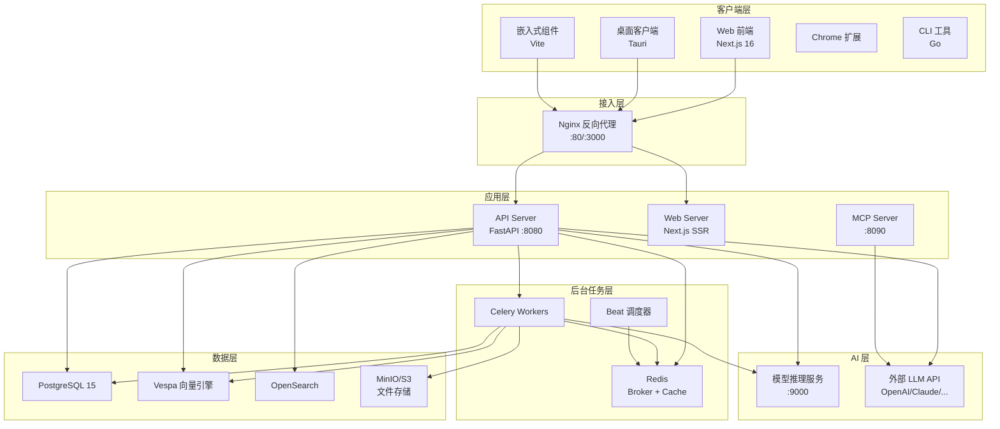

# Onyx 架构总览

> [!info] 项目概述
> **Onyx**（原名 Danswer）是一个开源的企业级 Gen-AI 与搜索引擎平台，连接企业文档、应用和人员，提供基于 RAG 的智能检索与对话能力。
>
> - **许可证**: MIT（社区版）+ 商业（企业版）
> - **代码规模**: ~3,650+ 文件（~2,043 Python, ~1,610 TypeScript）
> - **数据库迁移**: 336 个 Alembic 迁移文件

---

## 一、系统全景



---

## 二、技术栈

| 层级 | 技术 | 版本 |
|------|------|------|
| **后端框架** | Python / FastAPI / Uvicorn | 3.11+ / 0.133 / 0.35 |
| **任务队列** | Celery (线程池模式) | 5.5.1 |
| **ORM** | SQLAlchemy (async) + Alembic | 2.0 / 1.10 |
| **前端框架** | Next.js / React / TypeScript | 16.1 / 19.2 / 5.9 |
| **状态管理** | Zustand + SWR | 5.0 / 2.1 |
| **UI 库** | Radix UI + Tailwind CSS | -- / 3.4 |
| **向量数据库** | Vespa | 8.609 |
| **全文搜索** | OpenSearch | 3.4 |
| **关系数据库** | PostgreSQL | 15.2 |
| **缓存** | Redis | 7.4 |
| **LLM 网关** | LiteLLM | 1.81 |
| **对象存储** | MinIO (S3 兼容) | -- |
| **可观测性** | Sentry + OpenTelemetry + Prometheus | -- |
| **部署** | Docker Compose / Helm / Terraform / AWS ECS | -- |

---

## 三、目录结构

```
onyx/
├── backend/                    # 后端 Python 应用
│   ├── onyx/                   # 社区版核心包
│   │   ├── auth/               # 认证与授权
│   │   ├── access/             # 访问控制 (RBAC)
│   │   ├── background/         # Celery 后台任务系统
│   │   │   └── celery/         #   Worker 定义 / 任务 / 调度
│   │   ├── cache/              # 缓存层 (Redis/Postgres)
│   │   ├── chat/               # 聊天与 LLM 交互
│   │   ├── configs/            # 应用配置
│   │   ├── connectors/         # 55+ 数据连接器
│   │   ├── context/            # 上下文管理
│   │   ├── db/                 # 数据库模型与操作
│   │   ├── deep_research/      # 深度研究功能
│   │   ├── document_index/     # Vespa 向量索引
│   │   ├── error_handling/     # 统一错误处理
│   │   ├── evals/              # LLM 评估框架
│   │   ├── federated_connectors/ # 联合搜索连接器
│   │   ├── file_processing/    # 文件解析引擎
│   │   ├── file_store/         # 文件存储抽象
│   │   ├── hooks/              # 生命周期钩子
│   │   ├── image_gen/          # 图片生成
│   │   ├── indexing/           # 文档索引管道
│   │   ├── key_value_store/    # KV 存储抽象
│   │   ├── kg/                 # 知识图谱
│   │   ├── llm/                # LLM 提供商抽象
│   │   ├── mcp_server/         # MCP 协议服务
│   │   ├── prompts/            # LLM 提示词模板
│   │   ├── redis/              # Redis 客户端
│   │   ├── secondary_llm_flows/# 次级 LLM 流程
│   │   ├── server/             # FastAPI 路由与 API
│   │   ├── tools/              # LLM 工具定义
│   │   ├── tracing/            # 分布式追踪
│   │   ├── utils/              # 通用工具
│   │   ├── voice/              # 语音/TTS
│   │   └── main.py             # FastAPI 入口
│   ├── ee/onyx/                # 企业版包 (扩展 CE)
│   ├── alembic/                # 数据库迁移 (主 Schema)
│   ├── alembic_tenants/        # 多租户迁移 (私有 Schema)
│   ├── model_server/           # 嵌入模型推理服务
│   └── tests/                  # 测试套件
│
├── web/                        # Next.js 前端
│   ├── src/
│   │   ├── app/                # App Router 页面
│   │   ├── components/         # React 组件
│   │   ├── hooks/              # 自定义 Hooks
│   │   ├── lib/                # 业务逻辑 & API 客户端
│   │   ├── layouts/            # 页面布局
│   │   ├── providers/          # React Context
│   │   ├── sections/           # 功能性组合组件
│   │   ├── ee/                 # 企业版前端
│   │   └── interfaces/         # TypeScript 类型定义
│   └── tests/e2e/              # Playwright E2E 测试
│
├── desktop/                    # Tauri 桌面客户端
├── widget/                     # 可嵌入聊天组件
├── extensions/chrome/          # Chrome 浏览器扩展
├── cli/                        # Go CLI 工具
├── deployment/                 # 部署配置
│   ├── docker_compose/         # 12 种 Compose 变体
│   ├── helm/                   # Kubernetes Helm Charts
│   ├── terraform/              # Terraform IaC
│   └── aws_ecs_fargate/        # AWS ECS 部署
└── tools/ods/                  # Onyx 开发者工具
```

---

## 四、核心架构模式

### 4.1 请求处理流程

```
用户请求 → Nginx → FastAPI
    → 中间件链 (CORS / Auth / Tenant / Metrics / Tracing)
    → 路由分发 (server/ 下的 Router)
    → 业务逻辑 (service 层)
    → 数据访问 (db/ 操作 PostgreSQL)
    → 响应 (统一 OnyxError 错误处理)
```

### 4.2 文档索引流程

```
数据源 → Connector (拉取文档)
    → DocFetching Worker → DocProcessing Worker
    → 文件解析 (file_processing/)
    → 文本分块 (indexing/ chunking)
    → 上下文注入 (Contextual RAG)
    → 嵌入生成 (model_server/:9000)
    → 向量写入 Vespa + 元数据写入 PostgreSQL
```

### 4.3 聊天/搜索流程

```
用户查询 → API Server
    → 查询预处理 (NLP)
    → Vespa 混合检索 (向量 + 关键词)
    → 重排序 (Reranker)
    → 上下文组装
    → LLM 调用 (LiteLLM → OpenAI/Claude/...)
    → 流式响应 (SSE)
    → 引用注入 (Citation)
```

### 4.4 后台任务架构

```
Beat 调度器
    → Redis Broker (queue routing)
    → Worker 池 (线程模式):
        ├── Primary (4线程) — 协调任务
        ├── DocFetching (1线程) — 文档拉取
        ├── DocProcessing (6线程) — 文档处理
        ├── Light (24线程) — 轻量操作
        ├── Heavy (4线程) — 资源密集型
        ├── Monitoring (1线程) — 健康监控
        ├── KG Processing (可配) — 知识图谱
        └── User File Processing (2线程) — 用户文件
```

---

## 五、多租户支持

- **PostgreSQL Schema 隔离**: 每个租户拥有独立的 PostgreSQL Schema (`schema_private`)
- **双 Alembic 管理**: 主 Schema (`alembic/`) + 租户 Schema (`alembic_tenants/`)
- **租户感知中间件**: 自动从请求中提取租户 ID
- **任务隔离**: Celery 任务自动携带租户上下文
- **动态 Beat 调度**: `DynamicTenantScheduler` 按租户调度周期任务

---

## 六、模块导航

| 文档 | 描述 |
|------|------|
| [[01-后端核心架构]] | FastAPI 入口、API 路由、中间件、配置系统、错误处理 |
| [[02-Celery 后台任务系统]] | Worker 定义、任务目录、调度机制、分布式锁 |
| [[03-数据连接器体系]] | 55+ 连接器、生命周期、凭证管理、联邦搜索 |
| [[04-索引与搜索管道]] | 文档索引、Vespa/OpenSearch、混合检索、知识图谱 |
| [[05-LLM 与 AI 集成层]] | LiteLLM 抽象、聊天循环、工具调用、深度研究 |
| [[06-认证与权限体系]] | OAuth/OIDC/SAML、RBAC、文档权限、多租户 |
| [[07-数据库与存储层]] | PostgreSQL 模型、Alembic 迁移、Redis、文件存储 |
| [[08-前端架构]] | Next.js App Router、组件体系、状态管理、Chat UI |
| [[09-企业版增强模块]] | EE 独有功能、特性门控、SCIM、计费、外部权限 |
