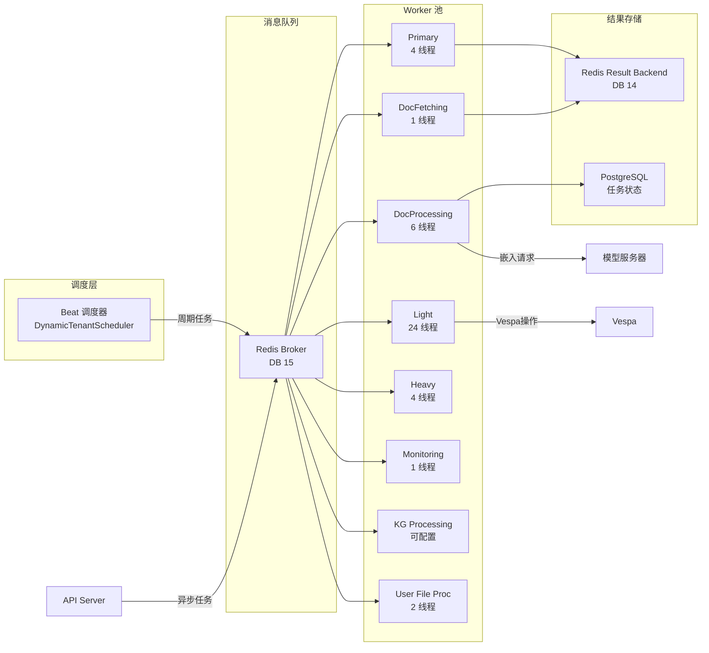

# Celery 后台任务系统

> [!info] 模块路径
> `backend/onyx/background/` — 异步任务处理引擎，基于 Celery 5.5 + Redis Broker，所有 Worker 使用线程池模式。

---

## 一、系统架构



---

## 二、Worker 定义 (`background/celery/apps/`)

| Worker | 并发 | 消费队列 | 职责 |
|--------|------|---------|------|
| **Primary** | 4 | PRIMARY | 连接器删除、Vespa 同步、剪枝检查、LLM 模型更新 |
| **DocFetching** | 1 | CONNECTOR_DOC_FETCHING | 从数据源拉取文档、生成 docprocessing 子任务 |
| **DocProcessing** | 6 | DOCPROCESSING | 文档解析→分块→嵌入→Vespa 写入 |
| **Light** | 24 | VESPA_METADATA_SYNC / DOC_PERMISSIONS_UPSERT | Vespa 元数据同步、文档权限更新 |
| **Heavy** | 4 | PRIMARY | 文档剪枝（资源密集型） |
| **Monitoring** | 1 | MONITORING | 系统健康监控、队列深度检查 |
| **KG Processing** | 可配 | SANDBOX | 知识图谱实体提取与聚类 |
| **User File Processing** | 2 | USER_FILE_PROCESSING | 用户上传文件索引 |
| **Beat** | 1 | — | 周期任务调度器 |

> [!warning] 关键设计
> - 所有 Worker 使用**线程池**（非进程池），确保内存稳定性
> - Celery 的 `time_limit` 在线程池模式下**静默失效**，超时必须在任务内部实现
> - 每个任务**必须设置 `expires`**，防止队列无限增长

---

## 三、任务定义目录 (`background/celery/tasks/`)

```
tasks/
├── shared/          # 共享任务（@shared_task）
│   └── tasks.py     # 通用工具任务
├── periodic/        # 周期任务
│   └── tasks.py     # 定时检查（索引/连接器/剪枝）
├── docfetching/     # 文档拉取任务
│   ├── tasks.py     # 拉取主任务
│   └── task_creation_utils.py  # 子任务生成
├── docprocessing/   # 文档处理任务
│   └── tasks.py     # 索引管道任务
├── pruning/         # 剪枝任务
│   └── tasks.py     # 过期文档清理
├── monitoring/      # 监控任务
│   └── tasks.py     # 健康检查
├── vespa/           # Vespa 操作
│   └── document_sync.py  # 文档同步
└── beat_schedule.py # Beat 调度配置
```

### 核心任务类型

| 任务 | Worker | 描述 |
|------|--------|------|
| 连接器删除检查 | Primary | 每 20s，检查待删除连接器并执行清理 |
| Vespa 同步检查 | Primary | 每 20s，同步 Vespa 索引与数据库状态 |
| 剪枝检查 | Primary/Heavy | 每 20s，检测并清理过期/无效文档 |
| 索引检查 | Primary | 每 15s，检查需要索引的文档并调度处理 |
| KG 处理 | KG Processing | 每 60s，知识图谱实体/关系处理 |
| 监控任务 | Monitoring | 每 5min，队列深度、内存使用、进程存活 |
| 连接器文档拉取 | DocFetching | 按连接器周期从外部源拉取文档 |
| 文档处理 | DocProcessing | 解析→分块→嵌入→写入向量库 |
| 元数据同步 | Light | 文档权限、元数据更新到 Vespa |

---

## 四、Beat 调度系统

### DynamicTenantScheduler

继承 Celery `Scheduler`，实现**多租户感知**的周期调度：

```
标准 Beat: 固定 schedule → 所有租户共享
DynamicTenantScheduler:
    → 查询所有活跃租户
    → 为每个租户生成独立的周期任务
    → 任务携带 tenant_id 上下文
    → 通过中间件自动注入租户隔离
```

### 调度间隔

| 任务 | 间隔 |
|------|------|
| 索引检查 | 15s |
| 连接器删除 | 20s |
| Vespa 同步 | 20s |
| 剪枝检查 | 20s |
| KG 处理 | 60s |
| 监控 | 5min |
| 清理 | 1h |

---

## 五、分布式锁 (`OnyxRedisLocks`)

通过 Redis 实现的分布式协调机制，定义在 `configs/constants.py`：

```python
class OnyxRedisLocks(StrEnum):
    PRUNING_LOCK = "pruning_lock"                    # 剪枝操作互斥
    DOC_PERMISSIONS_SYNC_LOCK = "doc_perms_lock"      # 权限同步互斥
    INDEXING_LOCK = "indexing_lock"                   # 索引操作互斥
    VESPA_SYNC_LOCK = "vespa_sync_lock"              # Vespa 同步互斥
    # ... 约 30 个命名锁
```

**使用模式**:
```python
with redis.lock(OnyxRedisLocks.PRUNING_LOCK, timeout=3600):
    # 执行剪枝操作，1小时超时
```

---

## 六、版本化应用 (`versioned_apps/`)

### 设计动机

当后台任务代码更新时，正在执行的任务仍使用旧代码。版本化应用通过**版本号**隔离新旧任务：

```
标准 Celery App: 所有任务共享同一实现
Versioned Celery App:
    → 每次部署生成新版本号
    → 任务消息携带版本信息
    → Worker 根据版本路由到对应实现
    → 旧版本任务自然过期
```

### 版本化 Worker

| Worker | 版本化 |
|--------|--------|
| Primary | `versioned_apps/primary.py` |
| DocFetching | `versioned_apps/docfetching.py` |
| Client | `versioned_apps/client.py` |

---

## 七、内存监控 (`memory_monitoring.py`)

- **用途**: 防止 Worker 因内存泄漏 OOM
- **机制**: 定期检查进程 RSS 内存，超过阈值时触发告警或重启
- **监控 Worker**: 由 Monitoring Worker 执行

---

## 八、任务优先级 (`OnyxCeleryPriority`)

5 级优先级队列：

```
HIGHEST > HIGH > MEDIUM > LOW > LOWEST
```

关键任务（如用户触发的索引）使用高优先级，后台维护任务使用低优先级。

---

## 九、Supervisord 管理

`backend/supervisord.conf` 管理所有 Worker 进程：

```ini
[program:celery-primary]
command=celery -A onyx.background.celery.apps.primary worker ...
[program:celery-docfetching]
command=celery -A onyx.background.celery.apps.docfetching worker ...
[program:celery-beat]
command=celery -A onyx.background.celery.apps.beat beat ...
# ... 每个 Worker 一个 program
```

单一 Docker 容器内通过 Supervisord 运行所有 Worker。
