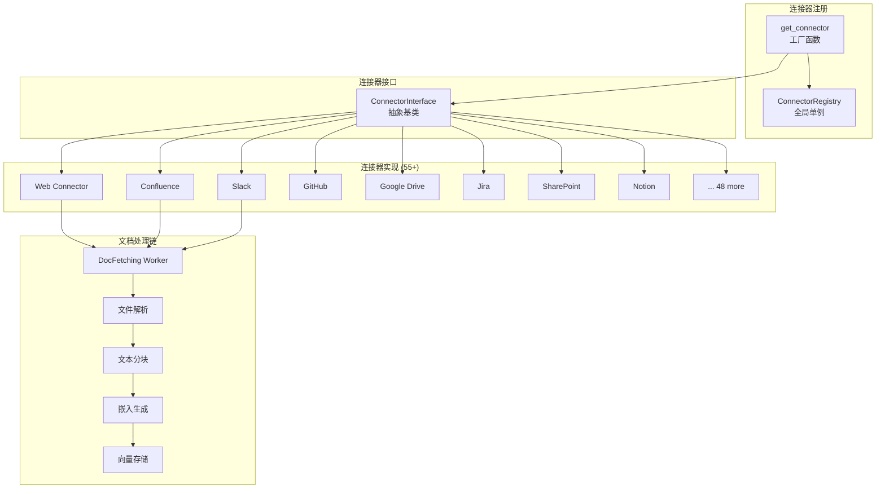

# 数据连接器体系

> [!info] 模块路径
> `backend/onyx/connectors/` — 55+ 外部数据源连接器，统一的拉取-处理-索引生命周期。

---

## 一、连接器架构



---

## 二、连接器接口

### 核心抽象

```python
class ConnectorInterface(ABC):
    """所有连接器必须实现的接口"""

    @abstractmethod
    def load_credentials(self, credentials: dict) -> None:
        """加载连接凭证"""

    @abstractmethod
    def fetch_all(self) -> Generator[ConnectorDocument, None, None]:
        """拉取所有文档，生成器模式"""

    @abstractmethod
    def fetch_since(self, start_time: datetime) -> Generator[ConnectorDocument, None, None]:
        """增量拉取（基于时间戳）"""

    @abstractmethod
    def fetch_done(self) -> bool:
        """是否所有文档已拉取完成"""
```

### 文档模型

```python
@dataclass
class ConnectorDocument:
    id: str                    # 文档唯一标识（由连接器生成）
    title: str                 # 文档标题
    content: str               # 文档正文
    source_type: DocumentSource # 数据源类型枚举
    semantic_identifier: str   # 语义标识（用于去重）
    doc_updated_at: datetime   # 文档最后更新时间
    primary_owners: list[str]  # 文档所有者（用于权限）
    secondary_owners: list[str]
    metadata: dict             # 自定义元数据
    additional_info: dict      # 额外信息
```

---

## 三、连接器注册与工厂

### 注册表模式

```python
# ConnectorRegistry — 全局注册表
class ConnectorRegistry:
    _registry: dict[DocumentSource, type[ConnectorInterface]] = {}

    @classmethod
    def register(cls, source: DocumentSource, connector_class: type):
        cls._registry[source] = connector_class

    @classmethod
    def get(cls, source: DocumentSource) -> type[ConnectorInterface]:
        return cls._registry[source]

# 工厂函数
def get_connector(source: DocumentSource) -> ConnectorInterface:
    connector_class = ConnectorRegistry.get(source)
    return connector_class()
```

### 自动发现

每个连接器模块通过装饰器或模块级注册自动注册到 `ConnectorRegistry`。

---

## 四、连接器类型清单 (55+)

### 协作工具
| 连接器 | DocumentSource | 描述 |
|--------|---------------|------|
| Slack | SLACK | Slack 频道消息与文件 |
| Teams | TEAMS | Microsoft Teams 消息 |
| Discord | DISCORD | Discord 频道消息 |
| Zulip | ZULIP | Zulip 消息 |

### 知识管理
| 连接器 | DocumentSource | 描述 |
|--------|---------------|------|
| Confluence | CONFLUENCE | Atlassian Confluence 页面 |
| Notion | NOTION | Notion 页面与数据库 |
| Gitbook | GITBOOK | GitBook 文档 |
| Guru | GURU | Guru 知识卡片 |
| Slab | SLAB | Slab 知识库 |
| Coda | CODA | Coda 文档 |
| Bookstack | BOOKSTACK | BookStack 页面 |
| Outline | OUTLINE | Outline 文档 |

### 代码托管
| 连接器 | DocumentSource | 描述 |
|--------|---------------|------|
| GitHub | GITHUB | GitHub 仓库（代码、Issue、PR） |
| GitLab | GITLAB | GitLab 仓库 |
| Bitbucket | BITBUCKET | Bitbucket 仓库 |

### 项目管理
| 连接器 | DocumentSource | 描述 |
|--------|---------------|------|
| Jira | JIRA | Jira Issue 与评论 |
| Linear | LINEAR | Linear Issue |
| Asana | ASANA | Asana 任务 |
| Clickup | CLICKUP | ClickUp 任务 |
| Productboard | PRODUCTBOARD | Productboard 功能请求 |
| TestRail | TESTRAIL | TestRail 测试用例 |

### 云存储
| 连接器 | DocumentSource | 描述 |
|--------|---------------|------|
| Google Drive | GOOGLE_DRIVE | Google Drive 文件 |
| Dropbox | DROPBOX | Dropbox 文件 |
| SharePoint | SHAREPOINT | SharePoint 文档库 |
| Blob (S3) | BLOB | S3/R2/GCS/OCI 对象存储 |
| File | FILESYSTEM | 本地文件系统 |
| Egnyte | EGGYTE | Egnyte 云文件 |

### 邮件
| 连接器 | DocumentSource | 描述 |
|--------|---------------|------|
| Gmail | GMAIL | Gmail 邮件 |
| IMAP | IMAP | 通用 IMAP 邮箱 |

### CRM / 销售
| 连接器 | DocumentSource | 描述 |
|--------|---------------|------|
| Salesforce | SALESFORCE | Salesforce 记录 |
| Hubspot | HUBSPOT | HubSpot CRM 数据 |
| Zendesk | ZENDESK | Zendesk 工单 |
| Freshdesk | FRESHDESK | Freshdesk 工单 |
| Gong | GONG | Gong 销售通话记录 |
| RequestTracker | REQUEST_TRACKER | RT 工单 |

### 通用
| 连接器 | DocumentSource | 描述 |
|--------|---------------|------|
| Web | WEB | 网页爬取 |
| Wikipedia | WIKIPEDIA | Wikipedia 文章 |
| MediaWiki | MEDIAWIKI | MediaWiki 站点 |
| Document360 | DOCUMENT360 | Document360 文档 |
| Discourse | DISCOURSE | Discourse 论坛 |
| Xenforo | XENFORO | XenForo 论坛 |
| Drupal Wiki | DRUPAL_WIKI | Drupal Wiki |
| Loopio | LOOPIO | Loopio RFP 响应 |
| Fireflies | FIREFLIES | Fireflies 会议记录 |
| Canvas | CANVAS | Canvas LMS |
| Highspot | HIGHSPOT | Highspot 内容 |

---

## 五、连接器生命周期

```
1. 创建 (POST /api/manage/connector)
    → 存储连接器配置到 PostgreSQL
    → 加载凭证（加密存储）

2. 凭证验证 (POST /api/manage/connector/credential)
    → 使用存储的凭证尝试连接数据源
    → 验证 API Key / OAuth Token 有效性

3. 首次同步 (触发 DocFetching Worker)
    → DocFetching Worker: get_connector(source) → connector.fetch_all()
    → 生成 ConnectorDocument 流
    → 按 INDEX_BATCH_SIZE (16) 分批
    → 为每批创建 DocProcessing 子任务

4. 增量同步 (Beat 周期调度)
    → connector.fetch_since(last_sync_time)
    → 只拉取变更的文档

5. 删除 (后台任务)
    → 标记连接器为删除中
    → Primary Worker: 逐步清理文档、Vespa 索引、数据库记录
    → 最终删除连接器配置
```

---

## 六、凭证管理

### 加密存储

```
凭证存储流程:
    用户输入凭证 → 后端加密 (ENCRYPTION_KEY_SECRET)
    → PostgreSQL (Credential 表，加密字段)
    → 连接器使用时解密
```

### OAuth 凭证刷新

- **OAuth Token Manager**: 管理 OAuth 访问令牌的生命周期
- **自动刷新**: 当 Token 过期时自动使用 Refresh Token 刷新
- **多提供商支持**: Google OAuth, Microsoft OAuth, 自定义 OIDC

---

## 七、联邦连接器 (`federated_connectors/`)

### 与常规连接器的区别

| 维度 | 常规连接器 | 联邦连接器 |
|------|-----------|-----------|
| **数据位置** | 拉取到本地索引 | 查询时实时访问外部源 |
| **数据新鲜度** | 取决于同步频率 | 实时 |
| **Vespa 索引** | 需要 | 不需要 |
| **适用场景** | 需要语义搜索的文档 | 需要实时数据的外部系统 |

### 联邦搜索流程

```
用户查询 → API Server
    → 并行查询:
        ├── Vespa 本地索引 (常规文档)
        └── 联邦连接器 (实时外部查询)
    → 结果合并与去重
    → 重排序
    → LLM 生成回答
```

### 联邦连接器接口

```python
class FederatedConnectorInterface(ABC):
    @abstractmethod
    def search(self, query: str) -> list[FederatedConnectorDocument]:
        """实时搜索外部数据源"""
```

---

## 八、连接器配置

每个连接器可通过环境变量进行微调：

| 配置项 | 示例 | 描述 |
|--------|------|------|
| `CONFLUENCE_BATCH_SIZE` | 50 | Confluence 页面批量大小 |
| `SLACK_CHANNEL_SKIP_LIST` | "general,random" | 跳过的频道 |
| `GITHUB_RATE_LIMIT` | 5000 | GitHub API 速率限制 |
| `SHAREPOINT_BATCH_SIZE` | 100 | SharePoint 文件批量大小 |
| `CONNECTOR_DOC_BATCH_SIZE` | 16 | 通用文档批量大小 |
