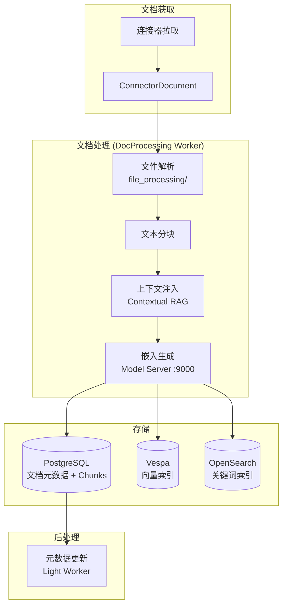
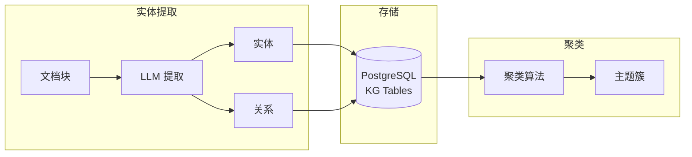

# 索引与搜索管道

> [!info] 模块路径
> `backend/onyx/indexing/` + `backend/onyx/document_index/` + `backend/onyx/kg/` — 从文档到向量、从查询到答案的完整数据管道。

---

## 一、索引管道全景



---

## 二、文档索引详细流程

### 2.1 文档解析 (`file_processing/`)

```
原始文件 (PDF/DOCX/HTML/...)
    → 格式检测
    → 内容提取引擎:
        ├── PDF: pypdf / markitdown
        ├── DOCX: python-docx
        ├── PPTX: python-pptx
        ├── XLSX: openpyxl
        ├── HTML: BeautifulSoup + trafilatura
        └── 通用: unstructured
    → 文本清洗 (去除样板、规范化空白)
    → 结构化输出 (Document + Sections)
```

### 2.2 文本分块 (`indexing/`)

分块策略可配置，支持多种模式：

| 参数 | 默认值 | 描述 |
|------|--------|------|
| `INDEX_BATCH_SIZE` | 16 | 每批索引的文档数 |
| `MINI_CHUNK_SIZE` | 150 | 小分块最小 token 数 |
| `LARGE_CHUNK_RATIO` | 4 | 大分块与小分块的比例 |
| `MAX_DOCUMENT_CHARS` | 5,000,000 | 单文档最大字符数 |
| `MAX_FILE_SIZE_BYTES` | 2GB | 单文件最大大小 |
| `ENABLE_MULTIPASS_INDEXING` | true | 多轮索引（父子块） |
| `ENABLE_CONTEXTUAL_RAG` | true | 上下文 RAG 增强 |

#### 多轮索引 (Multi-pass Indexing)

```
第一轮: 大分块 (Large Chunks)
    → 整个文档或大段落
    → 生成高质量嵌入
    → 用于语义检索

第二轮: 小分块 (Mini Chunks)
    → 按段落/句子分割
    → 关联到父大分块
    → 提供细粒度匹配
```

#### 上下文 RAG (Contextual RAG)

```
为每个分块生成上下文前缀:
    原始分块: "...性能优化策略包括缓存和索引..."
    上下文注入: "本段讨论了系统性能优化，具体策略包括缓存和索引..."

    → 通过 LLM 为每个分块生成简短上下文描述
    → 前置到分块内容前
    → 提高嵌入质量和检索精度
```

### 2.3 嵌入生成

```
分块文本
    → Model Server (:9000)
    → 嵌入模型 (默认: nomic-ai/nomic-embed-text-v1)
    → 768 维向量 (DOC_EMBEDDING_DIM=768)
    → 批处理 (EMBEDDING_THREAD_COUNT=8)
```

#### 支持的嵌入模型 (20 种)

| 提供商 | 模型 | 精度 |
|--------|------|------|
| Cohere | embed-english-v3.0 / embed-multilingual-v3.0 | BFLOAT16, FLOAT |
| OpenAI | text-embedding-3-small / text-embedding-3-large | BFLOAT16, FLOAT |
| Google Gemini | gemini-embedding-001 | BFLOAT16, FLOAT |
| Voyage | voyage-3 / voyage-3-lite | BFLOAT16, FLOAT |
| Nomic | nomic-embed-text-v1.5 | BFLOAT16, FLOAT |
| E5 | multilingual-e5-large | BFLOAT16, FLOAT |

### 2.4 向量写入

```
嵌入向量
    ├── Vespa: document_index/vespa/
    │   → 批量 upsert ( Vespa 客户端 )
    │   → 包含向量 + 文本 + 元数据
    │
    ├── PostgreSQL: db/
    │   → Document 表: 文档元数据
    │   → DocumentByUser 表: 文档-用户关联（权限）
    │   → Chunk 表: 分块内容
    │
    └── OpenSearch (可选):
        → 关键词索引
        → BM25 检索
```

---

## 三、Vespa 集成 (`document_index/vespa/`)

### 3.1 工厂模式

```python
# document_index/factory.py
def get_document_index() -> DocumentIndexInterface:
    """根据配置创建索引实例"""

class DocumentIndexInterface(ABC):
    @abstractmethod
    def index_document(self, doc: Document) -> None: ...
    @abstractmethod
    def delete_document(self, doc_id: str) -> None: ...
    @abstractmethod
    def hybrid_search(self, query: str, query_vec: list[float]) -> list[SearchResult]: ...
```

### 3.2 Vespa Schema

```yaml
# Vespa 文档 Schema (简化)
document onyx_doc {
    field doc_id type string
    field document_id type string
    field content type string
    field embedding type tensor<float>(x[768])
    field source_type type string
    field semantic_identifier type string
    field doc_updated_at type long
    field access_control_groups type array<string>

    # 混合搜索配置
    fieldset default {
        fields: content
    }

    # 近似最近邻 (ANN)
    index embedding {
        type: hnsw
        distance-metric: cosine
    }
}
```

### 3.3 混合搜索策略

```
用户查询
    → 查询向量化 (Model Server)
    → 并行执行:
        ├── 向量搜索 (HNSW ANN)
        │   → 返回 Top-K 相似文档
        │
        └── 关键词搜索 (BM25)
            → 返回 Top-K 文本匹配文档
    → 结果融合 (Reciprocal Rank Fusion)
    → 重排序 (Reranker, RERANK_COUNT=1000)
    → 权限过滤 (access_control_groups)
    → 返回最终结果
```

### 3.4 关键参数

| 参数 | 默认值 | 描述 |
|------|--------|------|
| `HYBRID_ALPHA` | 0.5 | 向量/关键词权重 (0=纯关键词, 1=纯向量) |
| `RERANK_COUNT` | 1000 | 重排序候选数量 |
| `MAX_CHUNKS_FED_TO_CHAT` | 25 | 送入 LLM 的最大块数 |

---

## 四、OpenSearch 集成

### 与 Vespa 的分工

| 维度 | Vespa | OpenSearch |
|------|-------|-----------|
| **向量搜索** | HNSW ANN | 不使用 |
| **关键词搜索** | BM25 (弱) | BM25 (强) |
| **聚合分析** | 不支持 | 支持 |
| **迁移路径** | — | 可选迁移 |

### 配置

```python
OPENSEARCH_HOST = "localhost"
OPENSEARCH_REST_API_PORT = 9200
ENABLE_OPENSEARCH_INDEXING_FOR_ONYX = True   # 双写索引
ENABLE_OPENSEARCH_RETRIEVAL_FOR_ONYX = False  # 默认不用于检索
```

---

## 五、知识图谱 (`kg/`)

### 架构



### 处理流程

1. **实体提取**: LLM 从文档中提取命名实体（人物、组织、概念）
2. **关系提取**: 识别实体间的关系
3. **存储**: 实体和关系存入 PostgreSQL KG 表
4. **聚类**: 定期运行聚类算法，将相关实体归为主题簇
5. **检索增强**: 搜索时可利用 KG 实体进行语义扩展

### 关键配置

| 参数 | 默认值 | 描述 |
|------|--------|------|
| 聚类相似度阈值 | 0.6 | 实体归入簇的最低相似度 |
| 归一化重排序权重 | 0.96 | 聚类重排序权重 |
| 最大深度搜索结果 | 30 | 深度搜索返回上限 |

---

## 六、搜索/查询完整流程

```
1. 用户输入查询
    → API: POST /api/chat/send_message

2. 查询预处理 (NLP)
    → 查询重写/扩展
    → 查询向量化 (Model Server :9000)

3. 多路检索
    → Vespa 混合检索 (向量 + BM25)
    → OpenSearch 检索 (如果启用)
    → 联邦连接器实时检索
    → 知识图谱语义扩展

4. 后处理
    → 权限过滤 (当前用户可访问的文档)
    → 去重
    → 重排序
    → Top-K 截断 (MAX_CHUNKS_FED_TO_CHAT=25)

5. 上下文组装
    → 文档块 + 元数据 → Prompt 模板
    → 文档时间衰减 (DOC_TIME_DECAY=0.5)

6. LLM 生成
    → LiteLLM → LLM Provider
    → 流式响应 (SSE)

7. 引用处理
    → CitationProcessor 匹配回答与源文档
    → 生成引用标注

8. 返回给用户
    → 流式: Server-Sent Events
    → 非流式: JSON 响应
```
