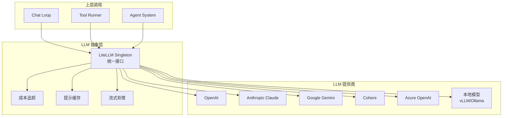
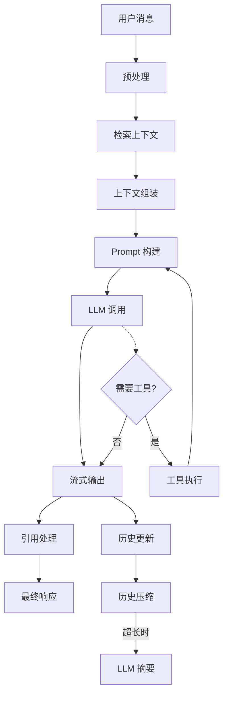

# LLM 与 AI 集成层

> [!info] 模块路径
> `backend/onyx/llm/` + `backend/onyx/chat/` + `backend/onyx/tools/` + `backend/onyx/prompts/` — 多 LLM 提供商抽象、聊天循环、工具调用、提示词管理。

---

## 一、LLM 抽象层 (`llm/`)

### 架构



### 核心组件

| 组件 | 文件 | 职责 |
|------|------|------|
| LiteLLM Singleton | `litellm_singleton/config.py` | 全局 LiteLLM 配置初始化 |
| 成本追踪 | `cost.py` | Token 使用量与费用计算 |
| 提示缓存 | `prompt_cache/` | OpenAI/Gemini 原生提示缓存 |
| 流式处理 | `streaming/` | SSE 流式响应管理 |
| 自定义头 | `custom_llm/` | 自定义 HTTP 头注入（如认证） |

### LLM 配置管理

```python
# llm_configs.py
class LLMConfig:
    model_version: str         # 模型标识 (e.g. "gpt-4o", "claude-3-opus")
    api_key: str | None        # API 密钥
    temperature: float = 0     # 生成温度
    max_tokens: int | None     # 最大输出 token
    timeout: int = 60          # 请求超时

# 支持自动 LLM 配置 URL
AUTO_LLM_CONFIG_URL: str | None  # 远程 LLM 配置端点
```

### 提示缓存

```
设计目的: 减少重复 LLM 调用的成本和延迟
实现:
    ├── OpenAI 原生缓存 (Automatic Caching)
    └── Gemini 上下文缓存
使用场景:
    → 系统提示词 (不变部分)
    → 工具定义 (不变部分)
    → 文档上下文 (频繁重复)
```

---

## 二、聊天系统 (`chat/`)

### 聊天循环架构



### 核心组件

| 文件 | 职责 |
|------|------|
| `streaming_handler.py` | SSE 流式响应处理，管理 Token 逐个输出 |
| `emitter.py` | 事件发射器，向前端推送聊天事件 |
| `citation_processor.py` | 引用处理器，匹配回答与源文档段落 |
| `compressor.py` | 聊天历史压缩，当历史过长时用 LLM 摘要 |
| `retrieval/search/` | 搜索与检索逻辑 |
| `retrieval/postprocessing.py` | 检索后处理（过滤、排序、截断） |

### 流式响应协议

```
SSE 事件类型:
    ├── message_start — 开始响应
    ├── message_delta — 内容增量 (Token 级)
    ├── citation — 引用信息
    ├── tool_call — 工具调用通知
    ├── message_end — 响应结束
    └── error — 错误信息
```

### 聊天会话管理

```
ChatSession (PostgreSQL)
    ├── 会话元数据 (标题、创建时间、用户)
    ├── 聊天历史 (Message 列表)
    │   ├── 用户消息
    │   ├── 助手消息
    │   └── 工具调用消息
    ├── 上下文窗口管理
    │   ├── 最大历史 token 数
    │   └── 自动压缩策略
    └── Persona 关联 (可选)
```

---

## 三、工具系统 (`tools/`)

### 工具架构

```python
# 工具接口
class ToolInterface(ABC):
    @abstractmethod
    def name(self) -> str: ...

    @abstractmethod
    def description(self) -> str: ...

    @abstractmethod
    def parameters(self) -> dict: ...

    @abstractmethod
    async def execute(self, params: dict) -> ToolResult: ...

# 工具运行器
class ToolRunner:
    registry: dict[str, ToolInterface]

    def register_tool(self, tool: ToolInterface): ...
    def run_tool(self, name: str, params: dict) -> ToolResult: ...
```

### 内置工具

| 工具 | 描述 |
|------|------|
| 网页搜索 | 通过 Exa API 进行互联网搜索 |
| 代码解释器 | 沙箱执行 Python 代码 (:8000) |
| 图片生成 | DALL-E / Stable Diffusion |
| 文档检索 | 从 Vespa 检索相关文档 |
| 计算器 | 数学计算 |

### 工具调用流程

```
LLM 生成 tool_call
    → ToolRunner 解析工具名和参数
    → 执行工具 (可能在沙箱中)
    → 收集工具结果
    → 将结果注入 Prompt
    → 再次调用 LLM 继续生成
    → (循环直到 LLM 不再请求工具)
```

---

## 四、提示词管理 (`prompts/`)

### 提示词模板体系

```
prompts/
├── chat/           # 聊天相关提示词
│   ├── system.py   # 系统提示词
│   ├── condense.py # 历史压缩提示词
│   └── citation.py # 引用生成提示词
├── search/         # 搜索相关提示词
│   └── query.py    # 查询重写提示词
├── qa/             # 问答相关
│   └── answer.py   # 回答生成提示词
└── agents/         # Agent 提示词
    └── agent.py    # Agent 系统提示词
```

### 提示词构建原则

- **系统提示词**: 定义 AI 助手的行为准则和约束
- **上下文注入**: 动态插入检索到的文档片段
- **引用指令**: 指导模型引用源文档
- **工具说明**: 描述可用工具的名称、描述和参数格式

---

## 五、深度研究 (`deep_research/`)

### 架构

```
用户研究请求
    → 查询分解 (LLM 将复杂问题分解为子问题)
    → 多轮检索
        ├── Vespa 内部搜索
        ├── 互联网搜索 (Exa API)
        └── 工具调用 (计算、代码执行)
    → 中间结果评估
    → 信息整合 (LLM 综合所有发现)
    → 生成研究报告
```

### 关键模型

```python
@dataclass
class DeepResearchState:
    original_query: str        # 原始研究问题
    sub_queries: list[str]     # 分解的子问题
    search_results: dict       # 搜索结果缓存
    current_step: int          # 当前步骤
    max_steps: int = 10        # 最大研究步骤
    findings: list[str]        # 发现和洞察
    final_report: str | None   # 最终报告
```

---

## 六、上下文管理 (`context/`)

### 搜索上下文

```python
class SearchContext:
    query: str                    # 用户查询
    retrieved_documents: list     # 检索到的文档
    user_accessible_docs: list    # 用户有权限的文档
    time_range: tuple | None      # 时间范围过滤
    filters: dict                 # 自定义过滤条件
```

### 后处理管道

```
检索结果
    → 权限过滤 (用户只能看到有权限的文档)
    → 文档时间衰减 (DOC_TIME_DECAY=0.5)
    → 去重 (基于 document_id)
    → 重排序
    → Top-K 截断
    → 标题/内容比例调整 (TITLE_CONTENT_RATIO=0.1)
```

---

## 七、语音功能 (`voice/`)

### TTS (文本转语音)

```python
# voice/tts.py
class TTSEngine:
    """语音合成引擎"""
    async def synthesize(self, text: str) -> bytes:
        """将文本转换为音频"""
```

### 语音输入

支持语音消息输入，通过前端录音 → Whisper ASR → 文本 → 正常聊天流程。

---

## 八、图片生成 (`image_gen/`)

### 接口

```python
class ImageGeneratorInterface(ABC):
    @abstractmethod
    async def generate(self, prompt: str) -> ImageResult: ...

class ImageResult:
    url: str          # 图片 URL 或 base64
    format: str       # 输出格式 (PNG/JPEG)
    width: int
    height: int
```

### 配置

```python
# tool_configs.py
IMAGE_GEN_OUTPUT_FORMAT: str = "png"  # 输出格式
IMAGE_ANALYSIS_MAX_SIZE: int = 20 * 1024 * 1024  # 图片分析最大 20MB
```

---

## 九、NLP 工具 (`natural_language_processing/`)

| 模块 | 功能 |
|------|------|
| `query_history.py` | 查询历史记录与用户画像 |
| `search_nlp_models.py` | 搜索相关的 NLP 模型 |
| `query_processing.py` | 查询预处理与重写 |

---

## 十、评估框架 (`evals/`)

```
evals/
├── 回答质量评估 — 评估 LLM 回答的准确性和相关性
├── 搜索质量评估 — 评估检索结果的相关性
└── 回归测试 (backend/tests/regression/) — 确保系统改进不退化
```
