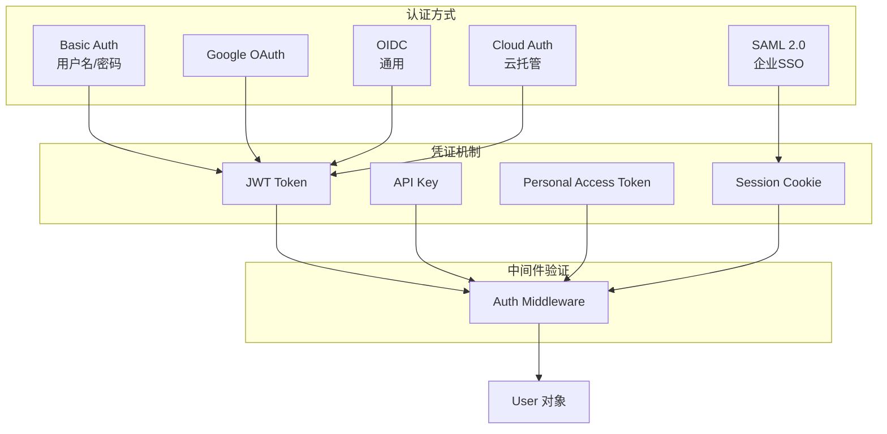
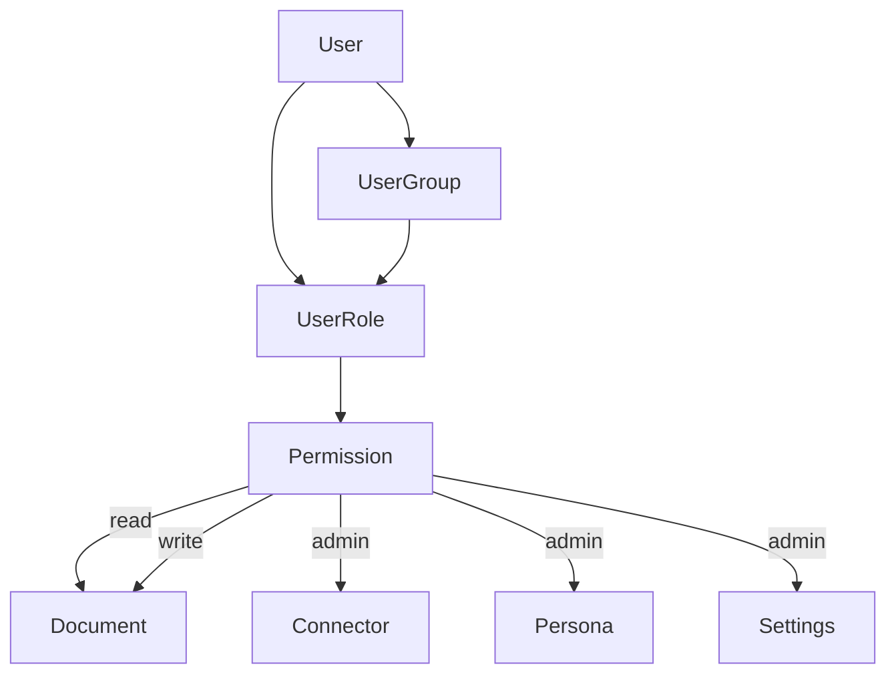

# 认证与权限体系

> [!info] 模块路径
> `backend/onyx/auth/` + `backend/onyx/access/` — 多认证方式、RBAC 访问控制、文档级权限、多租户隔离。

---

## 一、认证体系

### 支持的认证方式



### AuthType 枚举

```python
class AuthType(StrEnum):
    BASIC = "basic"               # 用户名/密码
    GOOGLE_OAUTH = "google_oauth"  # Google OAuth 2.0
    OIDC = "oidc"                 # 通用 OIDC (Okta, Auth0, 等)
    SAML = "saml"                 # SAML 2.0 SSO
    CLOUD = "cloud"               # 云托管认证
```

---

## 二、用户管理 (`auth/users.py`)

### User 模型

```python
class User(Base):
    __tablename__ = "user"

    id: int                    # 主键
    email: str                 # 邮箱 (唯一)
    hashed_password: str       # bcrypt 哈希密码
    is_active: bool            # 激活状态
    is_superuser: bool         # 超级管理员
    is_verified: bool          # 邮箱验证
    created_at: datetime
    updated_at: datetime

    # 关联
    roles: list[UserRole]      # 用户角色
    groups: list[UserGroup]    # 用户组
```

### 用户生命周期

```
1. 注册 (可选: VALID_EMAIL_DOMAINS 白名单)
2. 邮箱验证
3. 激活
4. 登录 → JWT/Session
5. 密码重置
6. 账户禁用
7. 账户删除
```

---

## 三、JWT 认证 (`auth/jwt.py`)

### Token 流程

```
登录请求
    → 验证凭证 (密码/OAuth/SAML)
    → 生成 JWT Access Token (短期, e.g. 15min)
    → 生成 JWT Refresh Token (长期, e.g. 7d)
    → 返回 Token 给前端

后续请求
    → Authorization: Bearer <access_token>
    → Auth Middleware 验证 Token
    → 提取 user_id
    → 加载 User 对象到 request.state
```

### OAuth Token 管理

```python
# auth/oauth_token_manager.py
class OAuthTokenManager:
    """管理 OAuth 令牌的存储与刷新"""

    def store_token(self, user_id: int, token: OAuthToken) -> None: ...
    def get_valid_token(self, user_id: int) -> OAuthToken: ...
    def refresh_token(self, user_id: int) -> OAuthToken: ...
```

---

## 四、API Key 认证 (`auth/api_key.py`)

```python
class APIKey(Base):
    __tablename__ = "api_key"

    id: int
    name: str                    # API Key 名称
    api_key_hash: str           # SHA256 哈希
    user_id: int                # 所属用户
    created_at: datetime
    last_used_at: datetime

# 使用方式
# Header: Authorization: Bearer <api_key>
# 或 Query: ?token=<api_key>
```

### Personal Access Token (`auth/pat.py`)

与 API Key 类似，但面向个人使用：
- 可设置过期时间
- 可设置权限范围
- 用于脚本和集成

---

## 五、CAPTCHA 集成 (`auth/captcha.py`)

```python
# 配置
CAPTCHA_ENABLED: bool = False
RECAPTCHA_SECRET_KEY: str | None

# 验证流程
async def verify_captcha(token: str) -> bool:
    """向 Google reCAPTCHA API 验证用户"""
```

---

## 六、匿名用户 (`auth/anonymous_user.py`)

```python
class AnonymousUser:
    """未认证用户的通用表示"""

    id: int = -1
    email: str = "anonymous"
    is_active: bool = False
    is_superuser: bool = False
    is_anonymous: bool = True
```

---

## 七、访问控制 (`access/`)

### RBAC 模型



### 核心函数

```python
# access/access.py
def verify_permission(
    user: User | AnonymousUser,
    resource_type: ResourceType,
    resource_id: int,
    access_type: AccessType,
) -> bool:
    """验证用户是否有权限访问指定资源"""

# access/hierarchy_access.py
def verify_hierarchy_access(
    user: User,
    document_set: DocumentSet,
    access_type: AccessType,
) -> bool:
    """验证文档集层级权限"""
```

### 访问类型

```python
class AccessType(StrEnum):
    READ = "read"
    WRITE = "write"
    ADMIN = "admin"
```

---

## 八、文档权限

### 权限模型

```
文档权限来源:
    ├── 文档集权限 (Document Set) — 管理员分配
    ├── 用户组权限 (User Group) — 组内共享
    ├── 连接器权限同步 — 从外部源同步 (如 Confluence 空间权限)
    └── 公开文档 — 所有用户可见
```

### Vespa 权限过滤

```
每个文档在 Vespa 中存储 access_control_groups 字段:
    → 用户查询时，附加用户的 group ID 列表
    → Vespa 在检索时进行权限过滤
    → 确保用户只能搜索到有权限的文档
```

### 权限同步

```
外部权限源 (Confluence 空间/SharePoint 站点/...)
    → DocFetching Worker 拉取文档时获取权限信息
    → Light Worker: DOC_PERMISSIONS_UPSERT 任务
    → 更新 PostgreSQL 中的权限记录
    → 同步到 Vespa 的 access_control_groups
```

---

## 九、多租户支持

### 租户隔离策略

| 层级 | 隔离方式 |
|------|---------|
| **数据库** | PostgreSQL Schema 隔离 (每租户独立 Schema) |
| **数据** | 租户 ID 列作为查询条件 |
| **任务** | Celery 任务携带 tenant_id |
| **缓存** | Redis 键前缀包含 tenant_id |
| **搜索** | Vespa 查询自动附加租户过滤 |

### 租户识别

```
请求 → Tenant Middleware
    → 从 JWT/Domain/Header 提取 tenant_id
    → 注入到 request.state.tenant_id
    → 后续所有数据库查询自动附加 tenant_id 过滤
```

### 动态租户调度

```
DynamicTenantScheduler (Beat):
    → 查询所有活跃租户
    → 为每个租户生成独立的周期任务
    → 任务携带 tenant_id 上下文
    → Worker 通过中间件自动注入租户隔离
```
