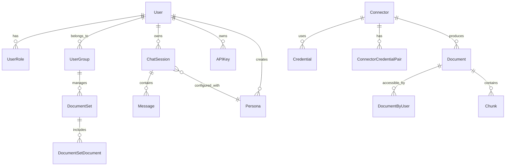
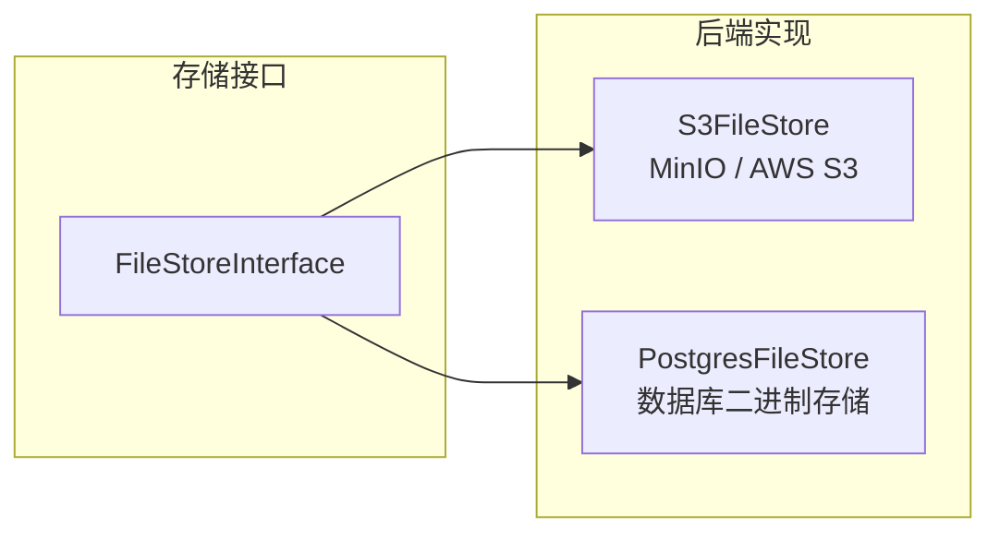

# 数据库与存储层

> [!info] 模块路径
> `backend/onyx/db/` + `backend/onyx/redis/` + `backend/onyx/file_store/` + `backend/alembic/` — 数据持久化、缓存、文件存储、数据库迁移。

---

## 一、PostgreSQL 数据模型

### ORM 架构

```
db/
├── __init__.py              # Base, Session 工厂
├── models.py                # (legacy) 部分模型
├── models/                  # 模型目录 (60+ 文件)
│   ├── user*.py             # 用户相关模型
│   ├── document*.py         # 文档模型
│   ├── connector*.py        # 连接器模型
│   ├── credential*.py       # 凭证模型
│   ├── chat*.py             # 聊天会话模型
│   ├── persona*.py          # AI 人设模型
│   ├── tool*.py             # 工具配置模型
│   ├── index*.py            # 索引状态模型
│   ├── search_setting*.py   # 搜索设置模型
│   └── ...                  # 更多模型
├── auth/                    # 认证相关数据操作
├── admin/                   # 管理操作
├── prompts/                 # 提示词存储
└── utils/                   # 数据库工具函数
```

### 核心数据模型



### 关键模型详解

#### 用户体系

| 模型 | 描述 |
|------|------|
| `User` | 用户基础信息 (email, password, is_active, is_superuser) |
| `UserRole` | 用户角色 (owner, admin, member, viewer) |
| `UserGroup` | 用户组 (名称、成员、关联文档集) |
| `APIKey` | API 密钥 (哈希、名称、所属用户) |
| `PersonalAccessToken` | 个人访问令牌 |

#### 文档体系

| 模型 | 描述 |
|------|------|
| `Document` | 文档元数据 (来源、标题、更新时间、链接) |
| `DocumentByUser` | 文档-用户权限映射 |
| `Chunk` | 文档分块 (内容、嵌入向量、所属文档) |
| `DocumentSet` | 文档集合 (管理员管理、权限控制单元) |
| `DocumentSetDocument` | 文档集与文档的多对多关联 |

#### 连接器体系

| 模型 | 描述 |
|------|------|
| `Connector` | 连接器配置 (类型、名称、频率、状态) |
| `Credential` | 加密凭证 (JSON 加密存储) |
| `ConnectorCredentialPair` | 连接器-凭证配对 |
| `ConnectorMissingDependency` | 连接器依赖缺失记录 |

#### 聊天体系

| 模型 | 描述 |
|------|------|
| `ChatSession` | 聊天会话 (标题、创建时间、关联人设) |
| `Message` | 消息记录 (角色、内容、工具调用) |
| `Persona` | AI 人设 (系统提示词、工具集、搜索设置) |
| `ChatFeedback` | 用户反馈 (点赞/点踩) |

#### 索引体系

| 模型 | 描述 |
|------|------|
| `IndexingStatus` | 索引状态追踪 |
| `IndexAttempt` | 索引尝试记录 |
| `IndexingCoordination` | 索引协调锁 |

---

## 二、数据库访问模式

### Session 管理

```python
# db/__init__.py
def get_sqlalchemy_engine() -> AsyncEngine:
    """获取异步 SQLAlchemy 引擎"""

async def get_session() -> AsyncGenerator[AsyncSession, None]:
    """FastAPI 依赖注入用的 Session 工厂"""
    async with async_session_maker() as session:
        yield session
```

### 连接池配置

```python
POSTGRES_POOL_SIZE: int = 40        # 主连接池
POSTGRES_MAX_OVERFLOW: int = 10     # 溢出连接
# API Server: 总共最多 50 个连接
# 最大连接数: 250 (PostgreSQL max_connections)
```

### 查询模式

```python
# 典型的 CRUD 操作
async def get_user(session: AsyncSession, user_id: int) -> User | None:
    result = await session.execute(
        select(User).where(User.id == user_id)
    )
    return result.scalar_one_or_none()

# 带租户隔离的查询
async def get_documents(session: AsyncSession, tenant_id: int):
    return await session.execute(
        select(Document)
        .where(Document.tenant_id == tenant_id)
    )
```

---

## 三、Alembic 迁移系统

### 双 Schema 迁移

```
alembic/                    # 主 Schema (共享表)
├── env.py                  # 迁移环境配置
├── script.py.mako          # 迁移模板
└── versions/               # 336 个迁移文件

alembic_tenants/            # 租户 Schema (私有表)
├── env.py
├── script.py.mako
└── versions/               # 租户级迁移
```

### 迁移配置

```ini
# alembic.ini
[alembic]
script_location = alembic
sqlalchemy.url = postgresql+asyncpg://...

[schema_private]
script_location = alembic_tenants
sqlalchemy.url = postgresql+asyncpg://...
```

### 迁移策略

| 命令 | 用途 |
|------|------|
| `alembic upgrade head` | 升级主 Schema |
| `alembic -n schema_private upgrade head` | 升级租户 Schema |
| `run_multitenant_migrations.py` | 对所有租户 Schema 运行迁移 |

### 迁移文件生命周期

```
alembic revision -m "description"
    → 生成版本化迁移文件
    → 自动运行 black -l 79 格式化
    → 手动编写 upgrade() 和 downgrade()
    → 代码审查
    → 合并到主分支
    → 部署时自动执行
```

---

## 四、Redis 使用

### Redis 数据库分配

| DB 编号 | 用途 |
|---------|------|
| 0 | 通用缓存 |
| 14 | Celery Result Backend |
| 15 | Celery Broker |

### 使用场景

```
1. 缓存层 (cache/)
    → 系统配置缓存
    → 用户会话缓存
    → 热点数据缓存

2. 分布式锁 (~30 个命名锁)
    → 剪枝锁 (pruning_lock, 1h 超时)
    → 索引锁 (indexing_lock)
    → 权限同步锁 (doc_perms_lock, 1h 超时)
    → Vespa 同步锁 (vespa_sync_lock)

3. Celery 消息队列
    → 任务分发 (Broker)
    → 任务结果 (Result Backend)

4. KV 存储
    → 系统状态
    → 连接器同步时间戳
    → 运行时配置
```

### 连接配置

```python
REDIS_HOST: str = "localhost"
REDIS_PORT: int = 6379
REDIS_SSL: bool = False
REDIS_CONNECTION_POOL_SIZE: int = 128
```

---

## 五、文件存储 (`file_store/`)

### 双后端实现



### S3 后端 (推荐)

```python
class S3FileStore:
    """S3/MinIO 文件存储"""

    async def upload(self, file: bytes, path: str) -> None: ...
    async def download(self, path: str) -> bytes: ...
    async def delete(self, path: str) -> None: ...
    async def exists(self, path: str) -> bool: ...

# 配置
S3_FILE_STORE_BUCKET_NAME: str = "onyx-files"
MINIO_ENDPOINT: str = "localhost:9000"
```

### Postgres 后端 (备用)

```python
class PostgresFileStore:
    """数据库文件存储（无 S3 时使用）"""
    # 使用 BLOB 字段存储文件内容
    # 适用于小规模部署
```

### 存储用途

| 场景 | 描述 |
|------|------|
| 连接器文件 | 从外部源拉取的原始文件 |
| 用户上传 | 用户直接上传的文档 |
| 模型缓存 | ML 模型文件缓存 |
| 导出数据 | 数据导出临时文件 |

---

## 六、键值存储 (`key_value_store/`)

```python
class KeyValueStoreInterface(ABC):
    @abstractmethod
    async def get(self, key: str) -> str | None: ...
    @abstractmethod
    async def set(self, key: str, value: str) -> None: ...
    @abstractmethod
    async def delete(self, key: str) -> None: ...

# 默认实现: PostgreSQL 表
class PostgresKeyValueStore(KeyValueStoreInterface):
    """基于 PostgreSQL 的 KV 存储"""
```

### 使用场景

```
key_value_store/
├── interface.py     # 抽象接口
├── store.py         # PostgreSQL 实现
└── factory.py       # 工厂函数
```

---

## 七、Hooks 系统 (`hooks/`)

### 生命周期钩子

```python
# 支持的钩子事件
class HookEvent(StrEnum):
    DOCUMENT_INDEXED = "document_indexed"    # 文档索引完成
    DOCUMENT_DELETED = "document_deleted"    # 文档删除
    USER_CREATED = "user_created"           # 用户创建
    CONNECTOR_CREATED = "connector_created"  # 连接器创建
    CHAT_MESSAGE = "chat_message"           # 聊天消息
```

### 钩子执行

```
业务操作完成
    → HookManager.emit(event, payload)
    → 遍历注册的 Hook 处理器
    → 异步执行（不阻塞主流程）
    → 错误记录但不影响主流程
```
