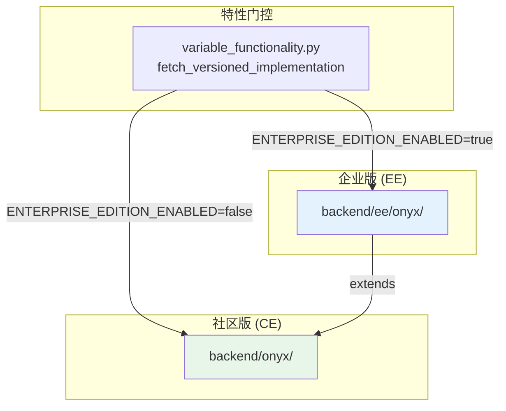
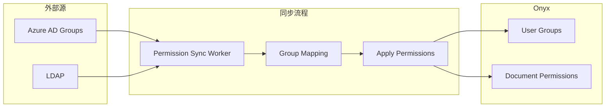
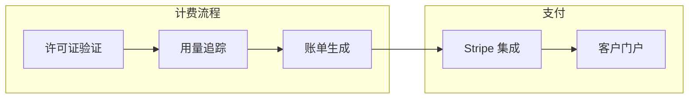

# 企业版增强模块

> [!info] 模块路径
> `backend/ee/onyx/` + `web/src/ee/` — 企业版独有功能，在社区版基础上扩展 SAML SSO、SCIM、计费、外部权限、审计日志等。

---

## 一、CE/EE 架构关系



### 设计原则

- **EE 是 CE 的扩展**: EE 模块引用 CE 代码，不重复实现
- **特性门控**: 运行时根据 `ENTERPRISE_EDITION_ENABLED` 环境变量选择实现
- **代码隔离**: EE 代码位于独立的 `ee/` 目录，不污染 CE 代码库
- **导入模式**: EE 通过 Python import 机制覆盖 CE 实现

### 版本化函数调用

```python
# utils/variable_functionality.py
def fetch_versioned_implementation(
    ee_module_path: str,
    ce_module_path: str,
    function_name: str,
) -> Callable:
    """
    根据 EE 开关选择实现版本
    CE 版本: onyx.module.function
    EE 版本: ee.onyx.module.function
    """
    if ENTERPRISE_EDITION_ENABLED:
        return import EE implementation
    else:
        return import CE implementation
```

---

## 二、EE 入口 (`ee/onyx/main.py`)

EE 入口扩展 CE 入口：

```python
# ee/onyx/main.py
# 1. 导入 CE 的 create_app
from onyx.main import create_app

# 2. 扩展路由
app = create_app()
# 注册 EE 专属路由
app.include_router(ee_admin_router)
app.include_router(ee_billing_router)
app.include_router(ee_scim_router)
app.include_router(ee_audit_router)

# 3. 添加 EE 中间件
app.add_middleware(TenantTrackingMiddleware)
app.add_middleware(UsageTrackingMiddleware)
```

---

## 三、EE 模块详解

### 3.1 增强认证 (`ee/onyx/auth/`)

| 模块 | 功能 |
|------|------|
| SAML 增强 | 企业 SSO 集成 (Microsoft Entra ID, Okta, OneLogin) |
| SCIM 2.0 | 自动用户置备/取消置备 |
| Domain 限制 | 邮箱域名白名单 |
| 审计日志 | 用户操作审计追踪 |

### SCIM 实现

```
企业 IdP (Azure AD / Okta)
    → SCIM 2.0 协议
    → POST /api/scim/v2/Users (创建用户)
    → PATCH /api/scim/v2/Users/{id} (更新用户)
    → DELETE /api/scim/v2/Users/{id} (删除用户)
    → GET /api/scim/v2/Groups (同步组)
    → Onyx 自动处理用户生命周期
```

### 3.2 增强访问控制 (`ee/onyx/access/`)

| 功能 | 描述 |
|------|------|
| 外部组同步 | 从 Azure AD / LDAP 同步用户组到 Onyx |
| 文档级权限 | 基于外部组的文档访问控制 |
| 权限继承 | 文档集 → 文档的权限继承链 |
| 高级 RBAC | 细粒度角色定义 (管理员/编辑/查看/无权限) |

### 3.3 外部权限同步 (`ee/onyx/external_permissions/`)



**同步机制**:
- 周期性同步 (由 Celery Beat 调度)
- 增量同步（基于变更检测）
- 映射表维护（外部组 ↔ Onyx 组）
- 冲突解决策略（外部优先 / 手动覆盖）

### 3.4 增强连接器 (`ee/onyx/connectors/`)

| 连接器 | EE 增强 |
|--------|--------|
| SharePoint | Azure AD 权限感知，文档级 ACL |
| Confluence | 空间权限同步 |
| Google Drive | 共享权限映射 |
| 通用 | 批量操作优化、速率限制调整 |

### 3.5 增强数据库模型 (`ee/onyx/db/`)

| 模型 | 描述 |
|------|------|
| `AuditLog` | 审计日志（用户操作追踪） |
| `UsageMetric` | 使用量指标（按租户/用户） |
| `BillingRecord` | 计费记录 |
| `License` | 许可证管理 |
| `Tenant` | 租户配置 |
| `ExternalGroup` | 外部组映射 |
| `UsageExport` | 使用量数据导出 |

### 3.6 增强后台任务 (`ee/onyx/background/`)

| 任务 | 描述 |
|------|------|
| 外部组同步 | 定期从 IdP 同步用户组 |
| 审计日志清理 | 自动清理过期审计日志 |
| 使用量聚合 | 按日/周/月聚合使用量数据 |
| 许可证检查 | 定期验证许可证有效性 |
| 租户配额检查 | 检查租户是否超出配额 |

### 3.7 增强搜索 (`ee/onyx/search/`)

| 功能 | 描述 |
|------|------|
| 搜索流分类 | 自动分类搜索意图（信息检索 vs 操作执行） |
| 个性化排序 | 基于用户历史行为的搜索结果排序 |
| 高级过滤 | 更丰富的搜索过滤条件 |

### 3.8 计费系统 (`ee/onyx/server/license/`)



- **许可证模型**: `License` 表存储许可证密钥、过期时间、功能范围
- **用量追踪**: 按 Token 使用量、API 调用次数、用户数量计费
- **Stripe 集成**: 订阅管理、发票生成、客户门户

### 3.9 增强提示词 (`ee/onyx/prompts/`)

```python
# ee/onyx/prompts/search_flow_classification.py
# 搜索流分类提示词：自动判断用户查询的意图类型
# 用于选择最佳的检索策略和响应模式
```

### 3.10 Onyx Bot 增强 (`ee/onyx/onyxbot/`)

企业级 Slack/Discord Bot 增强：
- 多频道支持
- 管理员控制面板
- 高级反馈收集
- Bot 行为统计

---

## 四、EE 中间件

### 租户追踪中间件

```python
# ee/onyx/server/middleware/tenant_tracking.py
class TenantTrackingMiddleware:
    """追踪每个租户的 API 使用情况"""

    async def __call__(self, request, call_next):
        tenant_id = get_tenant_id(request)
        # 记录请求指标
        record_usage(tenant_id, endpoint, tokens_used)
        response = await call_next(request)
        return response
```

---

## 五、EE 前端

### 路由扩展

```
web/src/app/ee/
├── admin/              # EE 管理功能
│   ├── audit-log/      # 审计日志查看
│   ├── billing/        # 计费管理
│   └── scim/           # SCIM 配置
├── agents/             # Agent 功能
├── layout.tsx          # EE 布局 (含 EE 导航)
└── EEFeatureRedirect.tsx  # EE 特性访问控制
```

### 特性重定向

```typescript
// 未购买 EE 功能时的重定向
if (!hasAccess("agents")) {
    return <EEFeatureRedirect feature="Agents" />;
}
// → 显示升级提示或重定向到定价页面
```

---

## 六、CE vs EE 功能对比

| 功能 | CE (MIT) | EE (商业) |
|------|---------|----------|
| 基础搜索 | ✅ | ✅ |
| 聊天/RAG | ✅ | ✅ |
| 连接器 (基础) | ✅ | ✅ |
| 向量搜索 (Vespa) | ✅ | ✅ |
| 知识图谱 | ✅ | ✅ |
| 多租户 | ❌ | ✅ |
| SAML SSO | ❌ | ✅ |
| SCIM 置备 | ❌ | ✅ |
| 外部权限同步 | ❌ | ✅ |
| 审计日志 | ❌ | ✅ |
| 使用分析 (PostHog) | ❌ | ✅ |
| 计费/订阅 | ❌ | ✅ |
| 高级 RBAC | ❌ | ✅ |
| 搜索流分类 | ❌ | ✅ |
| 个性化排序 | ❌ | ✅ |
| 增强型 Bot | ❌ | ✅ |
| 许可证管理 | ❌ | ✅ |

---

## 七、部署差异

| 维度 | CE | EE |
|------|----|----|
| Docker Compose | `docker-compose.yml` | `docker-compose.multitenant-dev.yml` |
| 环境变量 | 基础配置 | + `ENTERPRISE_EDITION_ENABLED=true` |
| 数据库 Schema | 单 Schema | + `schema_private` (每租户) |
| 迁移 | `alembic upgrade head` | + `alembic -n schema_private upgrade head` |
| 依赖 | 基础 pyproject.toml | + `ee` 依赖组 (posthog) |
