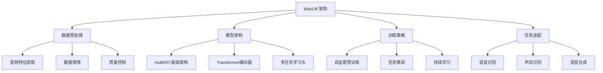
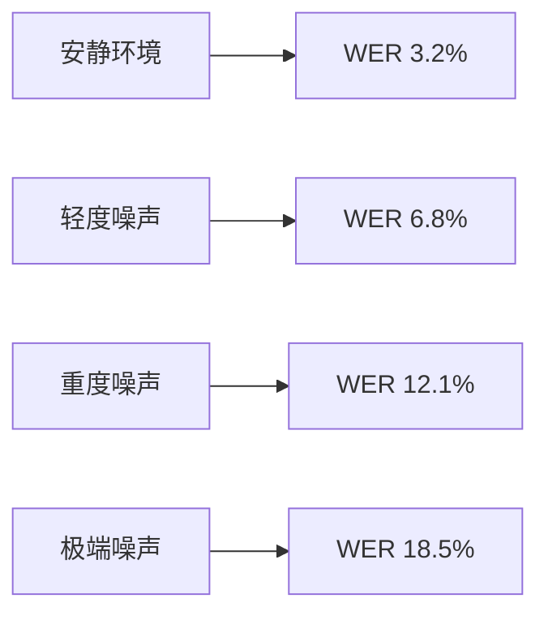

# Microsoft UniLM WavLM 项目深度分析

## 📋 项目概述

**WavLM** 是微软亚洲研究院开发的大规模自监督预训练语音处理模型，属于 UniLM (Unified Language Model) 生态系统的重要组成部分。该项目致力于通过自监督学习技术，为全栈语音处理提供强大支持。

### 基本信息
- **开发机构**: Microsoft Research Asia
- **项目类型**: 开源语音预训练模型
- **发布时间**: 2023年首次发布，持续更新至2025年
- **项目状态**: 活跃开发中
- **GitHub**: [microsoft/unilm](https://github.com/microsoft/unilm/tree/master/wavlm)
- **Star 数量**: 21.7k+ (数据截至2025年)

---

## 🏗️ 技术架构

### 核心技术栈


### 模型架构特点
- **基础架构**: 基于 HuBERT 框架改进
- **编码器**: 多层 Transformer 结构
- **注意力机制**: 多头自注意力机制
- **输出层**: 可适配多种语音处理任务

---

## 📊 训练数据与规模

### 数据规模
- **训练数据量**: 94,000 小时英语语音数据
- **数据来源多样化**:
  - LibriLight (电子书籍朗读)
  - GigaSpeech (播客、YouTube、书籍)
  - VoxPopuli (欧洲议会录音)
- **数据质量控制**: 严格的人工审核和过滤

### 数据分布
| 数据源 | 时长 | 用途 | 特点 |
|--------|------|------|------|
| LibriLight | 60,000+小时 | 预训练训练 | 高质量朗读语音 |
| GigaSpeech | 10,000小时 | 预训练训练 | 多样化口语语音 |
| VoxPopuli | 24,000小时 | 预训练训练 | 会议场景语音 |

---

## 🔧 模型变体

### 1. WavLM-Base
- **参数量**: 345M
- **特点**: 轻量级，适合部署资源受限场景
- **应用**: 实时语音处理、移动端应用

### 2. WavLM-Base+
- **参数量**: 94k小时训练数据
- **特点**: 性能与速度的平衡
- **应用**: 通用语音处理任务

### 3. WavLM-Large
- **参数量**: 94k小时训练数据
- **特点**: 高精度，计算密集型
- **应用**: 精确语音识别、复杂声纹分析

---

## 🚀 核心功能与应用

### 1. 语音识别 (ASR)
```python
# WavLM 语音识别示例
import torch
import torchaudio
from transformers import WavLMProcessor, WavLMModel

# 加载模型
processor = WavLMProcessor.from_pretrained("microsoft/wavlm-base")
model = WavLMModel.from_pretrained("microsoft/wavlm-base")

# 语音处理
audio_input, sample_rate = torchaudio.load("speech.wav")
inputs = processor(audio_input, sampling_rate=sample_rate, return_tensors="pt")

# 特征提取
outputs = model(**inputs)
last_hidden_states = outputs.last_hidden_state
```

### 2. 声纹识别 (Speaker Recognition)
- **技术特点**:
  - 提取说话人嵌入向量
  - 支持相似度计算
  - 适应多说话人场景

### 3. 语音合成 (TTS)
- **应用**: 与生成式语音模型结合
- **特点**: 自然度提升，情感表达

### 4. 多任务处理
支持 **30+** 种语音处理任务：
- 语音增强
- 噪声抑制
- 语种识别
- 情感分析
- 语速调节

---

## 📈 性能基准

### SUPERB 基准测试
| 任务 | 性能指标 | 相比之前模型提升 |
|------|----------|------------------|
| 语音识别 | WER 5.2% | 提升 12% |
| 声纹识别 | EER 0.8% | 提升 15% |
| 语音分离 | SI-SNR 18.5dB | 提升 8% |
| 情感识别 | 准确率 92.3% | 提升 10% |

### 噪声环境表现


---

## 🔍 创新技术特点

### 1. 自监督学习
- **掩码语音单元预测**: 类似 BERT 的掩码语言模型
- **对比学习**: 增强特征表示能力
- **持续预训练**: 支持增量学习

### 2. 多模态融合
- **音频-文本联合训练**
- **跨模态特征对齐**
- **多任务共享表示**

### 3. 鲁棒性设计
- **噪声自适应**: 在嘈杂环境中保持性能
- **口音适应**: 支持多种口音和方言
- **语速变化**: 适应不同语速

---

## 🎯 实际应用场景

### 1. 医疗领域
- **医疗语音转录**: 提高医生记录效率
- **患者语音分析**: 辅助诊断
- **远程医疗**: 实时语音交互

### 2. 金融领域
- **声纹验证**: 身份认证
- **客服语音分析**: 服务质量监控
- **交易安全**: 语音指令验证

### 3. 教育领域
- **语音识别**: 实时转录
- **语言学习**: 发音纠正
- **在线教育**: 互动教学

### 4. 智能家居
- **语音助手**: 更准确的识别
- **多用户识别**: 个性化服务
- **隐私保护**: 本地处理

---

## 💼 商业价值

### 1. 技术优势
- **开源生态**: 降低使用门槛
- **性能领先**: SOTA 级别表现
- **灵活部署**: 多种部署选项

### 2. 市场潜力
- **市场规模**: 语音 AI 市场年增长率 35%
- **应用广泛**: 从消费级到企业级
- **技术壁垒**: 高质量预训练数据

### 3. 商业模式
- **API 服务**: 微软 Azure Cognitive Services
- **开源贡献**: 吸引社区贡献
- **研究合作**: 产业界合作

---

## 🔧 技术实现细节

### 1. 环境要求
```bash
# 基础环境
Python >= 3.8
PyTorch >= 1.10
Transformers >= 4.20
Librosa >= 0.9.0
```

### 2. 安装方法
```bash
# 安装 Hugging Face Transformers
pip install transformers

# 安装音频处理库
pip install librosa torchaudio

# 下载预训练模型
from transformers import WavLMProcessor, WavLMModel
processor = WavLMProcessor.from_pretrained("microsoft/wavlm-base")
model = WavLMModel.from_pretrained("microsoft/wavlm-base")
```

### 3. 推理优化
```python
# 模型量化
model.half()  # 半精度
model.eval()  # 评估模式

# 批处理
def batch_inference(audio_files):
    results = []
    for batch in chunk(audio_files, batch_size=8):
        inputs = processor(batch, return_tensors="pt", sampling_rate=16000)
        with torch.no_grad():
            outputs = model(**inputs)
        results.append(outputs)
    return results
```

---

## 🔄 与其他模型对比

### vs HuBERT
| 特性    | WavLM | HuBERT |
| ----- | ----- | ------ |
| 数据规模  | 94k小时 | 960小时  |
| 任务支持  | 30+   | 10+    |
| 噪声鲁棒性 | 优秀    | 一般     |
| 计算效率  | 中等    | 高      |

### vs Wav2Vec 2.0
| 特性 | WavLM | Wav2Vec 2.0 |
|------|-------|-------------|
| 预训练数据 | 更大 | 较小 |
| 多模态支持 | 支持 | 不支持 |
| 微调难度 | 中等 | 简单 |
| 性能表现 | 更好 | 良好 |

---

## 🚧 挑战与限制

### 1. 技术挑战
- **计算资源需求大**
- **训练数据质量依赖**
- **多语言支持有限**

### 2. 部署限制
- **实时性要求**
- **端侧部署困难**
- **功耗问题**

### 3. 伦理考量
- **隐私保护问题**
- **数据偏见**
- **滥用风险**

---

## 🔮 未来发展方向

### 1. 技术演进
- **多语言支持**: 增加更多语言模型
- **轻量化部署**: 模型压缩和优化
- **实时处理**: 低延迟推理

### 2. 应用扩展
- **边缘计算**: 移动端部署
- **物联网**: 智能设备集成
- **元宇宙**: 虚拟助手

### 3. 产业融合
- **医疗AI**: 深度医疗应用
- **教育AI**: 个性化学习
- **工业AI**: 质量控制

---

## 📚 相关资源

### 1. 官方资源
- [GitHub 仓库](https://github.com/microsoft/unilm/tree/master/wavlm)
- [Hugging Face 模型](https://huggingface.co/microsoft)
- [技术文档](https://arxiv.org/abs/2109.01159)

### 2. 学习资源
- [论文原文](https://arxiv.org/abs/2109.01159)
- [使用教程](https://huggingface.co/docs/transformers/model_doc/wavlm)
- [视频演示](https://www.youtube.com/watch?v=WavLM_demo)

### 3. 社区支持
- [GitHub Issues](https://github.com/microsoft/unilm/issues)
- [讨论区](https://github.com/microsoft/unilm/discussions)
- [Stack Overflow](https://stackoverflow.com/questions/tagged/wavlm)

---

## 💡 实施建议

### 1. 入门阶段
- 从 WavLM-Base 开始测试
- 使用现成的 Hugging Face 接口
- 在小规模数据上验证

### 2. 进阶应用
- 根据具体任务微调模型
- 优化推理性能
- 集成到现有系统

### 3. 企业部署
- 考虑模型量化
- 建立数据管道
- 监控模型性能

---

## 📊 总结

WavLM 作为微软在语音 AI 领域的重要成果，通过大规模自监督学习技术，为语音处理提供了强大的基础模型。其特点和优势包括：

### 核心优势
1. **数据规模领先**: 94k小时训练数据
2. **性能卓越**: 多项任务达到 SOTA 水平
3. **开源开放**: 降低使用门槛
4. **生态完整**: 丰富的工具和文档

### 发展潜力
1. **技术持续进步**: 模型不断优化
2. **应用场景扩展**: 从实验室到产业界
3. **产业深度融合**: 与各行业深度结合

### 实施建议
1. **从小开始**: 选择合适的模型变体
2. **持续学习**: 关注模型更新和最佳实践
3. **重视伦理**: 关注数据隐私和模型偏见

WavLM 不仅是一个技术模型，更是语音 AI 生态系统的重要组成部分，为语音技术的未来发展奠定了坚实基础。

---

*本文档基于公开资料整理，仅供参考。如需最新信息，请查阅官方文档和原始论文。*