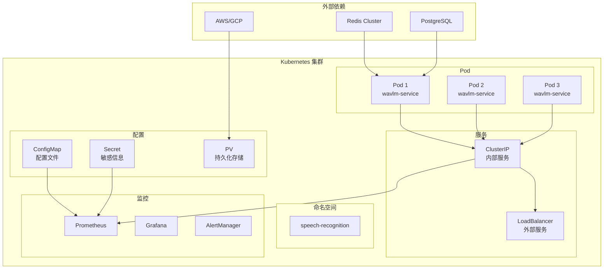

# Kubernetes 部署配置

## 📋 概述

本文档提供了 WavLM 声纹识别服务的完整 Kubernetes 部署配置，包括容器化配置、服务发现、负载均衡、监控告警等核心组件。

---

## 🏗️ 基础架构

### 1. 架构图



### 2. 组件清单

| 组件 | 用途 | 规格 |
|------|------|------|
| **API Service** | 主要推理服务 | 3-10个Pod |
| **Model Service** | 模型加载和管理 | 1个Pod |
| **Cache Service** | Redis 缓存 | 集群模式 |
| **Database** | PostgreSQL 数据库 | 主从复制 |
| **Monitoring** | 监控告警 | Prometheus+Grafana |
| **Ingress** | 外部流量入口 | Nginx Ingress |

---

## 🔧 配置文件

### 1. 命名空间配置

```yaml
# namespace.yaml
apiVersion: v1
kind: Namespace
metadata:
  name: speech-recognition
  labels:
    name: speech-recognition
    environment: production
  annotations:
    description: "WavLM 声纹识别服务生产环境"
```

### 2. 配置映射

```yaml
# configmap.yaml
apiVersion: v1
kind: ConfigMap
metadata:
  name: wavlm-config
  namespace: speech-recognition
data:
  # 模型配置
  model.config.json: |
    {
      "model_name": "wavlm-base",
      "model_path": "/app/models/wavlm-base",
      "embedding_dim": 768,
      "threshold": 0.8,
      "batch_size": 32,
      "max_length": 16000,
      "sample_rate": 16000
    }

  # 服务配置
  service.config.yaml: |
    server:
      host: "0.0.0.0"
      port: 8000
      workers: 4
      timeout: 30
    redis:
      host: "redis-service"
      port: 6379
      db: 0
      password: ""
    database:
      host: "postgres-service"
      port: 5432
      database: "speech_recognition"
      username: "postgres"
      password: ""
    monitoring:
      enabled: true
      metrics_port: 8001
      health_check_path: "/health"
    security:
      cors_origins: ["*"]
      max_file_size: 50
      allowed_formats: ["wav", "mp3"]

  # 日志配置
  logging.config.json: |
    {
      "version": 1,
      "disable_existing_loggers": false,
      "formatters": {
        "standard": {
          "format": "%(asctime)s [%(levelname)s] %(name)s: %(message)s"
        }
      },
      "handlers": {
        "console": {
          "class": "logging.StreamHandler",
          "formatter": "standard",
          "stream": "ext://sys.stdout"
        },
        "file": {
          "class": "logging.handlers.RotatingFileHandler",
          "formatter": "standard",
          "filename": "/app/logs/wavlm.log",
          "maxBytes": 10485760,
          "backupCount": 5
        }
      },
      "loggers": {
        "": {
          "handlers": ["console", "file"],
          "level": "INFO",
          "propagate": false
        }
      }
    }
```

### 3. 密钥配置

```yaml
# secrets.yaml
apiVersion: v1
kind: Secret
metadata:
  name: wavlm-secrets
  namespace: speech-recognition
type: Opaque
data:
  # 数据库密码
  postgres_password: cG9zdGdyZXNxbDpzZWNyZXQ=  # postgres:scret
  # Redis 密码
  redis_password: cmVkaXM=  # redis
  # API 密钥
  api_key: YXBpX2tleV9rZXk=  # api_key_key
  # 加密密钥
  encryption_key:ZW5jcnlwdGlvbl9rZXk=  # encryption_key
  # JWT 密钥
  jwt_secret: anVfeWV0X3NlY3JldF9zZWNyZXQ=  # jwt_secret_key
```

### 4. 模型持久化存储

```yaml
# persistent-volume.yaml
apiVersion: v1
kind: PersistentVolume
metadata:
  name: model-storage
spec:
  capacity:
    storage: 100Gi
  accessModes:
    - ReadWriteOnce
  persistentVolumeReclaimPolicy: Retain
  storageClassName: gp2
  awsElasticBlockStore:
    volumeID: vol-0123456789abcdef0
    fsType: ext4

---
apiVersion: v1
kind: PersistentVolumeClaim
metadata:
  name: model-storage-claim
  namespace: speech-recognition
spec:
  accessModes:
    - ReadWriteOnce
  resources:
    requests:
      storage: 100Gi
  storageClassName: gp2
```

### 5. 主部署配置

```yaml
# main-deployment.yaml
apiVersion: apps/v1
kind: Deployment
metadata:
  name: wavlm-service
  namespace: speech-recognition
  labels:
    app: wavlm-service
    version: v1.0.0
spec:
  replicas: 3
  selector:
    matchLabels:
      app: wavlm-service
  template:
    metadata:
      labels:
        app: wavlm-service
        version: v1.0.0
      annotations:
        prometheus.io/scrape: "true"
        prometheus.io/port: "8001"
        prometheus.io/path: "/metrics"
    spec:
      # 优先级类
      priorityClassName: high-priority
      # 节点选择器
      nodeSelector:
        node-role.kubernetes.io/worker: "true"
        nvidia.com/gpu: "true"
      # 容忍度
      tolerations:
      - key: "nvidia.com/gpu"
        operator: "Exists"
        effect: "NoSchedule"
      # 亲和性
      affinity:
        podAntiAffinity:
          preferredDuringSchedulingIgnoredDuringExecution:
          - weight: 100
            podAffinityTerm:
              labelSelector:
                matchExpressions:
                - key: app
                  operator: In
                  values:
                  - wavlm-service
              topologyKey: kubernetes.io/hostname
      # 资源限制
      containers:
      - name: wavlm-service
        image: vidya/wavlm-service:v1.0.0
        ports:
        - containerPort: 8000
          name: http
        - containerPort: 8001
          name: metrics
        env:
        - name: MODEL_PATH
          value: "/app/models/wavlm-base"
        - name: CONFIG_PATH
          value: "/app/config/model.config.json"
        - name: REDIS_URL
          value: "redis://redis-service:6379"
        - name: DB_URL
          valueFrom:
            secretKeyRef:
              name: wavlm-secrets
              key: postgres_url
        - name: LOG_LEVEL
          value: "INFO"
        - name: ENVIRONMENT
          value: "production"
        resources:
          requests:
            memory: "4Gi"
            cpu: "2"
            nvidia.com/gpu: "1"
          limits:
            memory: "16Gi"
            cpu: "8"
            nvidia.com/gpu: "1"
        livenessProbe:
          httpGet:
            path: /health
            port: 8000
          initialDelaySeconds: 30
          periodSeconds: 10
          timeoutSeconds: 5
          failureThreshold: 3
        readinessProbe:
          httpGet:
            path: /ready
            port: 8000
          initialDelaySeconds: 5
          periodSeconds: 5
          timeoutSeconds: 3
          failureThreshold: 3
        volumeMounts:
        - name: model-storage
          mountPath: /app/models
        - name: config
          mountPath: /app/config
        - name: logs
          mountPath: /app/logs
        securityContext:
          runAsUser: 1000
          runAsGroup: 1000
          capabilities:
            drop:
            - ALL
            add:
            - NET_BIND_SERVICE
      # 初始化容器
      initContainers:
      - name: model-downloader
        image: vidya/model-downloader:v1.0.0
        command: ["/bin/sh", "-c", "python download_models.py"]
        volumeMounts:
        - name: model-storage
          mountPath: /app/models
        resources:
          limits:
            memory: "2Gi"
            cpu: "1"
      # 卷
      volumes:
      - name: model-storage
        persistentVolumeClaim:
          claimName: model-storage-claim
      - name: config
        configMap:
          name: wavlm-config
      - name: logs
        emptyDir: {}
      # 生命周期
      lifecycle:
        preStop:
          exec:
            command: ["/bin/sh", "-c", "python graceful_shutdown.py"]
```

### 6. 服务配置

```yaml
# service.yaml
apiVersion: v1
kind: Service
metadata:
  name: wavlm-service
  namespace: speech-recognition
  labels:
    app: wavlm-service
spec:
  selector:
    app: wavlm-service
  ports:
  - name: http
    port: 80
    targetPort: 8000
  - name: metrics
    port: 8001
    targetPort: 8001
  type: ClusterIP

---
apiVersion: networking.k8s.io/v1
kind: Ingress
metadata:
  name: wavlm-ingress
  namespace: speech-recognition
  annotations:
    nginx.ingress.kubernetes.io/rewrite-target: /
    nginx.ingress.kubernetes.io/ssl-redirect: "true"
    nginx.ingress.kubernetes.io/rate-limit: "100"
    nginx.ingress.kubernetes.io/rate-limit-window: "1m"
    cert-manager.io/cluster-issuer: letsencrypt-prod
spec:
  tls:
  - hosts:
    - speech.vidda.com
    secretName: speech-tls
  rules:
  - host: speech.vidda.com
    http:
      paths:
      - path: /
        pathType: Prefix
        backend:
          service:
            name: wavlm-service
            port:
              name: http
```

### 7. 自动扩缩容

```yaml
# hpa.yaml
apiVersion: autoscaling/v2
kind: HorizontalPodAutoscaler
metadata:
  name: wavlm-service-hpa
  namespace: speech-recognition
spec:
  scaleTargetRef:
    apiVersion: apps/v1
    kind: Deployment
    name: wavlm-service
  minReplicas: 3
  maxReplicas: 10
  metrics:
  - type: Resource
    resource:
      name: cpu
      target:
        type: Utilization
        averageUtilization: 70
  - type: Resource
    resource:
      name: memory
      target:
        type: Utilization
        averageUtilization: 80
  - type: Pods
    pods:
      metric:
        name: http_requests_per_second
      target:
        type: AverageValue
        averageValue: 1000
  behavior:
    scaleDown:
      stabilizationWindowSeconds: 300
      policies:
      - type: Percent
        value: 10
        periodSeconds: 60
    scaleUp:
      stabilizationWindowSeconds: 60
      policies:
      - type: Percent
        value: 50
        periodSeconds: 60
      - type: Pods
        value: 2
        periodSeconds: 60
```

### 8. 网络策略

```yaml
# network-policy.yaml
apiVersion: networking.k8s.io/v1
kind: NetworkPolicy
metadata:
  name: wavlm-network-policy
  namespace: speech-recognition
spec:
  podSelector:
    matchLabels:
      app: wavlm-service
  policyTypes:
  - Ingress
  - Egress
  ingress:
  - from:
    - namespaceSelector:
        matchLabels:
          name: speech-recognition
    - podSelector:
        matchLabels:
          app: load-balancer
    ports:
    - protocol: TCP
      port: 8000
    - protocol: TCP
      port: 8001
  egress:
  - to:
    - namespaceSelector:
        matchLabels:
          name: speech-recognition
    - podSelector:
        matchLabels:
          app: database
    ports:
    - protocol: TCP
      port: 5432
    - protocol: TCP
      port: 6379
  - to:
    - namespaceSelector:
        matchLabels:
          name: monitoring
    ports:
    - protocol: TCP
      port: 9090
```

### 9. 配置管理

```yaml
# configmap-updater.yaml
apiVersion: v1
kind: ConfigMap
metadata:
  name: model-versions
  namespace: speech-recognition
data:
  versions.yaml: |
    versions:
      wavlm-base:
        version: "1.0.0"
        size: "5.2GB"
        checksum: "sha256:abc123..."
      wavlm-large:
        version: "1.0.0"
        size: "12.8GB"
        checksum: "sha256:def456..."
    last_updated: "2026-02-28T10:00:00Z"

---
apiVersion: batch/v1
kind: CronJob
metadata:
  name: model-updater
  namespace: speech-recognition
spec:
  schedule: "0 2 * * *"  # 每天凌晨2点
  jobTemplate:
    spec:
      template:
        spec:
          containers:
          - name: model-updater
            image: vidya/model-updater:v1.0.0
            env:
            - name: MODEL_REGISTRY_URL
              value: "https://models.vidda.com"
            - name: CONFIG_PATH
              value: "/app/config/model-versions.yaml"
            - name: STORAGE_PATH
              value: "/app/models"
            volumeMounts:
            - name: models
              mountPath: /app/models
          volumes:
          - name: models
            persistentVolumeClaim:
              claimName: model-storage-claim
```

---

## 🔧 部署脚本

### 1. 环境检查脚本

```bash
#!/bin/bash
# deploy-precheck.sh

set -e

echo "=== Kubernetes 部署前检查 ==="

# 检查 kubectl
if ! command -v kubectl &> /dev/null; then
    echo "❌ kubectl 未安装"
    exit 1
fi

# 检查集群连接
if ! kubectl cluster-info &> /dev/null; then
    echo "❌ 无法连接到 Kubernetes 集群"
    exit 1
fi

# 检查命名空间
if ! kubectl get namespace speech-recognition &> /dev/null; then
    echo "✅ 创建命名空间 speech-recognition"
    kubectl create namespace speech-recognition
fi

# 检查 GPU 支持
if ! kubectl get nodes -o jsonpath='{.items[*].status.allocatable.nvidia\.com/gpu}' | grep -q '[1-9]'; then
    echo "⚠️  未检测到 GPU 节点，将在 CPU 模式下运行"
fi

# 检查存储类
if ! kubectl get storageclass | grep -q gp2; then
    echo "❌ 未找到 gp2 存储类"
    exit 1
fi

# 检查 Ingress 控制器
if ! kubectl get ingressclass | grep - nginx; then
    echo "⚠️  未找到 Ingress 控制器，需要手动安装"
fi

echo "✅ 所有检查通过"
```

### 2. 部署脚本

```bash
#!/bin/bash
# deploy.sh

set -e

NAMESPACE="speech-recognition"
ENVIRONMENT=${1:-staging}

echo "=== 开始部署 WavLM 服务 ($ENVIRONMENT 环境) ==="

# 1. 创建基础资源
echo "📦 创建基础资源..."
kubectl apply -f k8s/namespace.yaml
kubectl apply -f k8s/configmap.yaml
kubectl apply -f k8s/secrets.yaml
kubectl apply -f k8s/persistent-volume.yaml
kubectl apply -f k8s/network-policy.yaml

# 2. 创建数据库服务
echo "🗄️  创建数据库服务..."
kubectl apply -f k8s/database/

# 3. 创建缓存服务
echo "🚀 创建缓存服务..."
kubectl apply -f k8s/redis/

# 4. 创建监控服务
echo "📊 创建监控服务..."
kubectl apply -f k8s/monitoring/

# 5. 部署主服务
echo "🎯 部署主服务..."
kubectl apply -f k8s/main-deployment.yaml

# 6. 创建服务
echo "🔌 创建服务..."
kubectl apply -f k8s/service.yaml

# 7. 配置 Ingress
if [ "$ENVIRONMENT" = "production" ]; then
    echo "🌐 配置生产环境 Ingress..."
    kubectl apply -f k8s/ingress.yaml
fi

# 8. 配置自动扩缩容
echo "⚡ 配置自动扩缩容..."
kubectl apply -f k8s/hpa.yaml

# 9. 等待部署完成
echo "⏳ 等待部署完成..."
kubectl rollout status deployment/wavlm-service -n $NAMESPACE --timeout=300s

# 10. 验证部署
echo "✅ 验证部署..."
kubectl get pods -n $NAMESPACE -l app=wavlm-service
kubectl get svc -n $NAMESPACE
kubectl get hpa -n $NAMESPACE

echo "🎉 部署完成！"
echo ""
echo "访问地址:"
if [ "$ENVIRONMENT" = "production" ]; then
    echo "  - API 端点: https://speech.vidda.com"
else
    echo "  - API 端点: http://localhost:8080"
fi
echo "  - 监控面板: http://localhost:3000"
```

### 3. 回滚脚本

```bash
#!/bin/bash
# rollback.sh

NAMESPACE="speech-recognition"

echo "=== 开始回滚部署 ==="

# 检查可用版本
kubectl rollout history deployment/wavlm-service -n $NAMESPACE

# 读取用户输入
read -p "请输入要回滚到的版本号: " REVISION

if [ -z "$REVISION" ]; then
    echo "❌ 未提供版本号"
    exit 1
fi

# 执行回滚
kubectl rollout undo deployment/wavlm-service --to-revision=$REVISION -n $NAMESPACE

# 等待回滚完成
kubectl rollout status deployment/wavlm-service -n $NAMESPACE --timeout=300s

echo "✅ 回滚完成"
```

---

## 📊 监控配置

### 1. Prometheus 配置

```yaml
# prometheus-config.yaml
apiVersion: v1
kind: ConfigMap
metadata:
  name: prometheus-config
  namespace: speech-recognition
data:
  prometheus.yml: |
    global:
      scrape_interval: 15s
      evaluation_interval: 15s

    scrape_configs:
    - job_name: 'kubernetes-pods'
      kubernetes_sd_configs:
      - role: pod
      relabel_configs:
      - source_labels: [__meta_kubernetes_pod_annotation_prometheus_io_scrape]
        action: keep
        regex: true
      - source_labels: [__meta_kubernetes_pod_annotation_prometheus_io_path]
        action: replace
        target_label: __metrics_path__
        regex: (.+)
      - source_labels: [__address__, __meta_kubernetes_pod_annotation_prometheus_io_port]
        action: replace
        regex: ([^:]+)(?::\d+)?;(\d+)
        replacement: $1:$2
        target_label: __address__
      - action: labelmap
        regex: __meta_kubernetes_pod_label_(.+)
      - source_labels: [__meta_kubernetes_namespace]
        action: replace
        target_label: namespace
      - source_labels: [__meta_kubernetes_pod_name]
        action: replace
        target_label: pod
      - source_labels: [__meta_kubernetes_service_name]
        action: replace
        target_label: service

    - job_name: 'wavlm-service'
      static_configs:
      - targets: ['wavlm-service:8001']
      scrape_interval: 5s
      metrics_path: /metrics
```

### 2. Grafana 仪表板

```json
{
  "dashboard": {
    "title": "WavLM 服务监控",
    "panels": [
      {
        "title": "QPS (每秒查询数)",
        "type": "graph",
        "targets": [
          {
            "expr": "rate(http_requests_total[5m])",
            "legendFormat": "QPS"
          }
        ],
        "gridPos": {"h": 8, "w": 12, "x": 0, "y": 0}
      },
      {
        "title": "响应时间分布",
        "type": "graph",
        "targets": [
          {
            "expr": "histogram_quantile(0.95, rate(http_request_duration_seconds_bucket[5m]))",
            "legendFormat": "P95 响应时间"
          },
          {
            "expr": "histogram_quantile(0.50, rate(http_request_duration_seconds_bucket[5m]))",
            "legendFormat": "P50 响应时间"
          }
        ],
        "gridPos": {"h": 8, "w": 12, "x": 12, "y": 0}
      },
      {
        "title": "错误率",
        "type": "singlestat",
        "targets": [
          {
            "expr": "rate(http_errors_total[5m]) / rate(http_requests_total[5m]) * 100",
            "legendFormat": "错误率"
          }
        ],
        "gridPos": {"h": 6, "w": 6, "x": 0, "y": 8}
      },
      {
        "title": "CPU 使用率",
        "type": "graph",
        "targets": [
          {
            "expr": "rate(container_cpu_usage_seconds_total{container=\"wavlm-service\"}[5m])",
            "legendFormat": "CPU 使用率"
          }
        ],
        "gridPos": {"h": 6, "w": 6, "x": 6, "y": 8}
      },
      {
        "title": "内存使用率",
        "type": "graph",
        "targets": [
          {
            "expr": "container_memory_usage_bytes{container=\"wavlm-service\"}",
            "legendFormat": "内存使用"
          }
        ],
        "gridPos": {"h": 6, "w": 6, "x": 12, "y": 8}
      },
      {
        "title": "GPU 使用率",
        "type": "graph",
        "targets": [
          {
            "expr": "gpu_utilization",
            "legendFormat": "GPU 使用率"
          }
        ],
        "gridPos": {"h": 6, "w": 6, "x": 18, "y": 8}
      },
      {
        "title": "模型推理时间",
        "type": "graph",
        "targets": [
          {
            "expr": "rate(model_inference_time_seconds_sum[5m]) / rate(model_inference_time_seconds_count[5m])",
            "legendFormat": "平均推理时间"
          }
        ],
        "gridPos": {"h": 6, "w": 6, "x": 0, "y": 14}
      },
      {
        "title": "活跃用户数",
        "type": "singlestat",
        "targets": [
          {
            "expr": "active_users",
            "legendFormat": "活跃用户"
          }
        ],
        "gridPos": {"h": 6, "w": 6, "x": 6, "y": 14}
      }
    ]
  }
}
```

---

## 🔧 故障排除

### 1. 常见问题

#### 1.1 Pod 启动失败
```bash
# 查看 Pod 状态
kubectl get pods -n speech-recognition

# 查看 Pod 详细信息
kubectl describe pod <pod-name> -n speech-recognition

# 查看 Pod 日志
kubectl logs <pod-name> -n speech-recognition --tail=100
```

#### 1.2 服务无法访问
```bash
# 检查服务端点
kubectl get svc -n speech-recognition

# 检查 Ingress 状态
kubectl get ingress -n speech-recognition

# 测试服务连接
kubectl run test-pod --image=busybox --rm -it -- wget -qO- http://wavlm-service:8000/health
```

#### 1.3 性能问题
```bash
# 查看资源使用情况
kubectl top pods -n speech-recognition

# 查看 HPA 状态
kubectl get hpa -n speech-recognition

# 查看事件
kubectl get events -n speech-recognition --sort-by='.metadata.creationTimestamp'
```

### 2. 应急响应

```bash
#!/bin/bash
# emergency-response.sh

NAMESPACE="speech-recognition"

echo "=== 应急响应操作 ==="

# 1. 滚动重启
kubectl rollout restart deployment/wavlm-service -n $NAMESPACE

# 2. 扩容
kubectl scale deployment wavlm-service --replicas=10 -n $NAMESPACE

# 3. 查看紧急日志
kubectl logs -l app=wavlm-service -n $NAMESPACE --tail=1000 | grep ERROR

# 4. 重启数据库
kubectl rollout restart deployment/database -n $NAMESPACE

# 5. 重启 Redis
kubectl rollout restart deployment/redis -n $NAMESPACE
```

---

## 📋 维护清单

### 1. 日常维护

- [ ] 监控系统性能指标
- [ ] 检查日志文件大小
- [ ] 验证数据备份状态
- [ ] 检查安全更新
- [ ] 审查访问日志

### 2. 周度维护

- [ ] 更新模型版本
- [ ] 清理临时文件
- [ ] 优化数据库性能
- [ ] 备份配置文件
- [ ] 测试灾难恢复

### 3. 月度维护

- [ ] 安全扫描
- [ ] 性能基准测试
- [ ] 容量规划
- [ ] 成本分析
- [ ] 文档更新

---

## 📞 支持信息

### 1. 联系方式
- **技术支持**: DevOps 团队
- **紧急联系人**: 运维工程师 24/7
- **文档**: Wiki 和运维手册

### 2. 故障报告
```bash
# 收集故障信息
kubectl cluster-info dump > cluster-info.txt
kubectl describe pods -n speech-recognition > pod-details.txt
kubectl logs -l app=wavlm-service -n speech-recognition > service-logs.txt
```

### 3. 版本管理
- **当前版本**: v1.0.0
- **维护版本**: v1.x.x
- **开发版本**: v2.0.0-dev

---

**注意**: 本配置文件需要根据实际的 Kubernetes 集群环境和业务需求进行调整。建议在生产环境使用前进行全面测试。