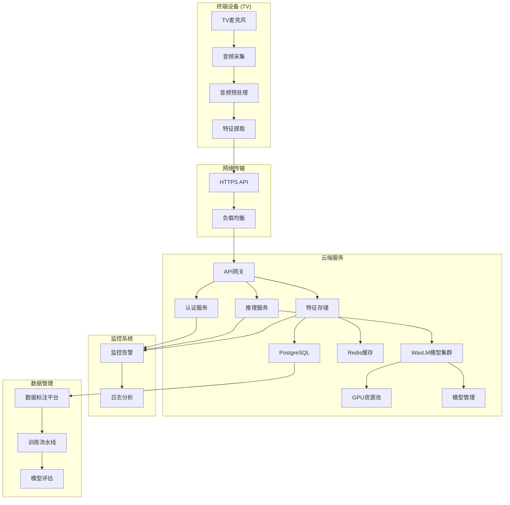

# WavLM 声纹识别云端部署和训练计划

## 📋 执行摘要

基于 **3.1.1.2 自研搭建** 的技术路线，本计划详细阐述了基于 WavLM + GPU 的云端声纹识别系统部署方案。系统采用微服务架构，支持实时语音识别、声纹验证、年龄/性别/情绪分析等功能，月预算约 $5000，预计 2-3 个月完成开发部署。

### 核心目标
- **实时推理**: TV设备音频 → 云端识别 → JSON响应 (<500ms)
- **多模态分析**: 声纹 + 年龄 + 性别 + 情绪识别
- **高可用性**: 99.9% 服务可用性
- **合规保障**: 遵循 GDPR 和中国个人信息保护法

---

## 🏗️ 整体架构设计

### 1. 系统架构图



### 2. 技术栈选择

| 层级 | 组件 | 选择 | 说明 |
|------|------|------|------|
| **基础设施** | 云服务商 | AWS/Azure | 根据成本和合规性选择 |
| **计算资源** | GPU集群 | A100/H100 | 高性能推理和训练 |
| **容器化** | Docker + Kubernetes | 生产级部署 |
| **服务框架** | FastAPI + PyTorch | 高性能Python框架 |
| **数据库** | Redis + PostgreSQL | 缓存 + 持久化 |
| **消息队列** | RabbitMQ/Kafka | 异步任务处理 |
| **监控** | Prometheus + Grafana | 全方位监控 |

---

## 🎯 部署方案详情

### 阶段一：基础设施搭建 (2周)

#### 1.1 云资源配置

```yaml
# 云资源配置方案
infrastructure:
  # GPU 资源池
  gpu_resources:
    - type: "NVIDIA A100"
      count: 2
      vram: "80GB"
      purpose: "模型推理"

    - type: "NVIDIA H100"
      count: 1
      vram: "80GB"
      purpose: "模型训练"

  # CPU 和内存
  compute_resources:
    cpu: "32核"
    memory: "128GB"
    storage: "2TB SSD"

  # 网络
  network:
    bandwidth: "1Gbps"
    security_groups: "restricted"
    load_balancer: "application"

  # 备份和监控
  backup:
    daily_backup: true
    retention_days: 30
  monitoring:
    uptime_monitor: true
    performance_alerts: true
```

#### 1.2 容器化部署

```dockerfile
# Dockerfile for WavLM Service
FROM pytorch/pytorch:2.1.0-cuda11.8-cudnn8-runtime

# 安装系统依赖
RUN apt-get update && apt-get install -y \
    libsndfile1 \
    ffmpeg \
    curl \
    && rm -rf /var/lib/apt/lists/*

# 安装 Python 依赖
COPY requirements.txt .
RUN pip install --no-cache-dir -r requirements.txt

# 复制应用代码
COPY app/ /app/
COPY models/ /app/models/

# 工作目录
WORKDIR /app

# 暴露端口
EXPOSE 8000

# 健康检查
HEALTHCHECK --interval=30s --timeout=10s --start-period=5s --retries=3 \
    CMD curl -f http://localhost:8000/health || exit 1

# 启动命令
CMD ["python", "-u", "main.py"]
```

#### 1.3 Kubernetes 部署配置

```yaml
# k8s-deployment.yaml
apiVersion: apps/v1
kind: Deployment
metadata:
  name: wavlm-service
  namespace: speech-recognition
spec:
  replicas: 3
  selector:
    matchLabels:
      app: wavlm-service
  template:
    metadata:
      labels:
        app: wavlm-service
    spec:
      containers:
      - name: wavlm-service
        image: vidya/wavlm-service:latest
        ports:
        - containerPort: 8000
        resources:
          requests:
            memory: "4Gi"
            cpu: "2"
          limits:
            memory: "16Gi"
            cpu: "8"
        env:
        - name: MODEL_PATH
          value: "/app/models/wavlm-base"
        - name: REDIS_URL
          value: "redis://redis-service:6379"
        - name: DB_URL
          valueFrom:
            secretKeyRef:
              name: database-secret
              key: url
        livenessProbe:
          httpGet:
            path: /health
            port: 8000
          initialDelaySeconds: 30
          periodSeconds: 10
        readinessProbe:
          httpGet:
            path: /ready
            port: 8000
          initialDelaySeconds: 5
          periodSeconds: 5

---
apiVersion: v1
kind: Service
metadata:
  name: wavlm-service
spec:
  selector:
    app: wavlm-service
  ports:
  - port: 80
    targetPort: 8000
  type: LoadBalancer

---
apiVersion: autoscaling/v2
kind: HorizontalPodAutoscaler
metadata:
  name: wavlm-service-hpa
spec:
  scaleTargetRef:
    apiVersion: apps/v1
    kind: Deployment
    name: wavlm-service
  minReplicas: 3
  maxReplicas: 10
  metrics:
  - type: Resource
    resource:
      name: cpu
      target:
        type: Utilization
        averageUtilization: 70
  - type: Resource
    resource:
      name: memory
      target:
        type: Utilization
        averageUtilization: 80
```

### 阶段二：模型训练 (4-6周)

#### 2.1 数据准备和处理

```python
# data_preprocessing.py
import torch
import torchaudio
import numpy as np
from pathlib import Path
import json
from concurrent.futures import ThreadPoolExecutor
import logging

class AudioDataProcessor:
    """音频数据预处理器"""

    def __init__(self, sample_rate=16000, max_duration=10.0):
        self.sample_rate = sample_rate
        self.max_duration = max_duration
        self.logger = logging.getLogger(__name__)

    def load_and_preprocess_audio(self, audio_path):
        """加载并预处理音频"""
        try:
            # 加载音频
            waveform, sample_rate = torchaudio.load(audio_path)

            # 转换为单声道
            if waveform.shape[0] > 1:
                waveform = torch.mean(waveform, dim=0, keepdim=True)

            # 重采样
            if sample_rate != self.sample_rate:
                resampler = torchaudio.transforms.Resample(sample_rate, self.sample_rate)
                waveform = resampler(waveform)

            # 限制长度
            max_length = int(self.sample_rate * self.max_duration)
            if waveform.shape[1] > max_length:
                # 取中间部分
                start = (waveform.shape[1] - max_length) // 2
                waveform = waveform[:, start:start + max_length]
            else:
                # 填充
                padding = max_length - waveform.shape[1]
                waveform = torch.nn.functional.pad(waveform, (0, padding))

            # 归一化
            waveform = (waveform - waveform.mean()) / (waveform.std() + 1e-8)

            return waveform.squeeze()

        except Exception as e:
            self.logger.error(f"Error processing {audio_path}: {str(e)}")
            return None

    def extract_wavlm_features(self, waveform, processor, model):
        """提取WavLM特征"""
        try:
            # 使用处理器
            inputs = processor(
                waveform.unsqueeze(0),
                sampling_rate=self.sample_rate,
                return_tensors="pt"
            )

            # 获取特征
            with torch.no_grad():
                outputs = model(**inputs)
                # 使用平均池化作为说话人嵌入
                embedding = outputs.last_hidden_state.mean(dim=1)

            return embedding.squeeze().numpy()

        except Exception as e:
            self.logger.error(f"Error extracting features: {str(e)}")
            return None

    def process_dataset(self, data_dir, processor, model, output_dir, num_workers=4):
        """处理整个数据集"""
        data_path = Path(data_dir)
        output_path = Path(output_dir)
        output_path.mkdir(parents=True, exist_ok=True)

        # 查找所有音频文件
        audio_files = list(data_path.glob("*.wav")) + list(data_path.glob("*.mp3"))

        processed_data = []

        # 使用多线程处理
        with ThreadPoolExecutor(max_workers=num_workers) as executor:
            futures = []

            for audio_file in audio_files:
                # 读取对应的标注文件
                annotation_file = audio_file.with_suffix('.json')

                if annotation_file.exists():
                    with open(annotation_file, 'r', encoding='utf-8') as f:
                        annotation = json.load(f)

                    future = executor.submit(
                        self._process_single_file,
                        audio_file, annotation, processor, model
                    )
                    futures.append((audio_file, future))

            # 收集结果
            for audio_file, future in futures:
                try:
                    result = future.result(timeout=60)
                    if result:
                        processed_data.append(result)

                        # 保存特征文件
                        feature_file = output_path / f"{audio_file.stem}_features.npz"
                        np.savez(feature_file, **result)

                except Exception as e:
                    self.logger.error(f"Error processing {audio_file}: {str(e)}")

        # 保存处理后的数据索引
        with open(output_path / "dataset_index.json", 'w', encoding='utf-8') as f:
            json.dump(processed_data, f, indent=2, ensure_ascii=False)

        self.logger.info(f"Processed {len(processed_data)} files")
        return processed_data

    def _process_single_file(self, audio_file, annotation, processor, model):
        """处理单个文件"""
        # 加载和预处理音频
        waveform = self.load_and_preprocess_audio(str(audio_file))
        if waveform is None:
            return None

        # 提取特征
        embedding = self.extract_wavlm_features(waveform, processor, model)
        if embedding is None:
            return None

        # 准备结果
        result = {
            'audio_file': str(audio_file),
            'user_id': annotation.get('user_id'),
            'speaker_id': annotation.get('speaker_id'),
            'gender': annotation.get('gender'),
            'age_group': annotation.get('age_group'),
            'emotion': annotation.get('emotion'),
            'embedding': embedding.tolist(),
            'embedding_shape': embedding.shape,
            'sample_rate': self.sample_rate,
            'duration': len(waveform) / self.sample_rate
        }

        return result
```

#### 2.2 模型微调训练

```python
# model_finetuning.py
import torch
import torch.nn as nn
import torch.optim as optim
from torch.utils.data import Dataset, DataLoader
from transformers import WavLMProcessor, WavLMModel, get_linear_schedule_with_warmup
import numpy as np
from pathlib import Path
import json
import logging
from typing import Dict, List, Optional, Tuple
from sklearn.model_selection import train_test_split

class SpeakerVerificationDataset(Dataset):
    """说话人验证数据集"""

    def __init__(self, data_path: str, train: bool = True):
        self.data_path = Path(data_path)
        self.train = train

        # 加载数据索引
        with open(self.data_path / "dataset_index.json", 'r', encoding='utf-8') as f:
            self.data = json.load(f)

        # 分割训练集和验证集
        train_data, val_data = train_test_split(self.data, test_size=0.2, random_state=42)
        self.data = train_data if train else val_data

        # 创建用户ID到索引的映射
        self.user_ids = list(set(item['user_id'] for item in self.data))
        self.user_to_idx = {uid: idx for idx, uid in enumerate(self.user_ids)}

        self.logger = logging.getLogger(__name__)
        self.logger.info(f"Loaded {len(self.data)} samples for {'train' if train else 'val'}")

    def __len__(self):
        return len(self.data)

    def __getitem__(self, idx):
        item = self.data[idx]

        # 加载特征
        feature_file = Path(item['audio_file']).with_suffix('_features.npz')
        features = np.load(feature_file)
        embedding = features['embedding']

        # 创建标签
        user_idx = self.user_to_idx[item['user_id']]

        # 对于训练，创建正负样本对
        if self.train:
            # 正样本（同一用户）
            positive_idx = np.random.choice([i for i, x in enumerate(self.data)
                                            if x['user_id'] == item['user_id'] and i != idx])
            positive_item = self.data[positive_idx]

            # 负样本（不同用户）
            negative_users = [uid for uid in self.user_ids if uid != item['user_id']]
            negative_user = np.random.choice(negative_users)
            negative_idx = np.random.choice([i for i, x in enumerate(self.data)
                                           if x['user_id'] == negative_user])
            negative_item = self.data[negative_idx]

            return {
                'anchor': embedding,
                'positive': np.load(Path(positive_item['audio_file']).with_suffix('_features.npz')['embedding']),
                'negative': np.load(Path(negative_item['audio_file']).with_suffix('_features.npz')['embedding']),
                'anchor_label': user_idx,
                'positive_label': user_idx,
                'negative_label': self.user_to_idx[negative_user]
            }
        else:
            # 验证时返回单个样本
            return {
                'embedding': embedding,
                'user_id': item['user_id'],
                'user_idx': user_idx,
                'gender': item.get('gender'),
                'age_group': item.get('age_group'),
                'emotion': item.get('emotion')
            }

class SpeakerVerificationModel(nn.Module):
    """说话人验证模型"""

    def __init__(self, embedding_dim: int = 768, num_users: int = 1000):
        super().__init__()

        # 特征投影层
        self.feature_projection = nn.Sequential(
            nn.Linear(embedding_dim, embedding_dim),
            nn.BatchNorm1d(embedding_dim),
            nn.ReLU(),
            nn.Dropout(0.1)
        )

        # 对比学习头
        self.projection_head = nn.Sequential(
            nn.Linear(embedding_dim, 256),
            nn.BatchNorm1d(256),
            nn.ReLU(),
            nn.Linear(256, 128)
        )

        # 用户分类头（用于验证）
        self.classifier = nn.Sequential(
            nn.Linear(embedding_dim, 512),
            nn.BatchNorm1d(512),
            nn.ReLU(),
            nn.Dropout(0.2),
            nn.Linear(512, num_users)
        )

    def forward(self, embeddings):
        # 特征投影
        projected = self.feature_projection(embeddings)

        # 对比学习特征
        contrastive_features = self.projection_head(projected)

        # 分类特征
        classification_logits = self.classifier(projected)

        return contrastive_features, classification_logits

class FineTuner:
    """模型微调器"""

    def __init__(self, config: Dict):
        self.config = config
        self.logger = self._setup_logger()

        # 设置设备
        self.device = torch.device("cuda" if torch.cuda.is_available() else "cpu")

        # 初始化模型和处理器
        self._initialize_models()

        # 准备数据
        self._prepare_data()

    def _setup_logger(self):
        """设置日志"""
        logger = logging.getLogger(__name__)
        logger.setLevel(logging.INFO)

        handler = logging.StreamHandler()
        formatter = logging.Formatter('%(asctime)s - %(levelname)s - %(message)s')
        handler.setFormatter(formatter)
        logger.addHandler(handler)

        return logger

    def _initialize_models(self):
        """初始化模型"""
        # 加载预训练 WavLM
        self.processor = WavLMProcessor.from_pretrained("microsoft/wavlm-base")
        self.wavlm_model = WavLMModel.from_pretrained("microsoft/wavlm-base")

        # 冻结 WavLM 参数
        for param in self.wavlm_model.parameters():
            param.requires_grad = False

        # 初始化验证模型
        self.model = SpeakerVerificationModel(
            embedding_dim=self.wavlm_model.config.hidden_size,
            num_users=self.config.get('num_users', 1000)
        )

        self.model.to(self.device)

        # 优化器
        self.optimizer = optim.AdamW(
            self.model.parameters(),
            lr=self.config.get('learning_rate', 1e-4),
            weight_decay=0.01
        )

        # 学习率调度器
        total_steps = len(self.train_loader) * self.config.get('epochs', 10)
        self.scheduler = get_linear_schedule_with_warmup(
            self.optimizer,
            num_warmup_steps=int(0.1 * total_steps),
            num_training_steps=total_steps
        )

    def _prepare_data(self):
        """准备数据"""
        # 创建数据集
        train_dataset = SpeakerVerificationDataset(
            self.config['data_path'], train=True
        )
        val_dataset = SpeakerVerificationDataset(
            self.config['data_path'], train=False
        )

        # 创建数据加载器
        self.train_loader = DataLoader(
            train_dataset,
            batch_size=self.config.get('batch_size', 32),
            shuffle=True,
            num_workers=4,
            pin_memory=True
        )

        self.val_loader = DataLoader(
            val_dataset,
            batch_size=self.config.get('batch_size', 64),
            shuffle=False,
            num_workers=4,
            pin_memory=True
        )

        self.logger.info(f"Data prepared - Train: {len(train_dataset)}, Val: {len(val_dataset)}")

    def train(self):
        """训练模型"""
        best_eer = float('inf')

        for epoch in range(self.config.get('epochs', 10)):
            # 训练
            train_loss = self._train_epoch(epoch)

            # 验证
            eer = self._validate_epoch()

            # 学习率调度
            self.scheduler.step()

            # 保存最佳模型
            if eer < best_eer:
                best_eer = eer
                self._save_model(f'best_model_eer_{eer:.4f}.pth')

            self.logger.info(f"Epoch {epoch}: Train Loss: {train_loss:.4f}, EER: {eer:.4f}")

        self.logger.info(f"Training completed. Best EER: {best_eer:.4f}")
        return best_eer

    def _train_epoch(self, epoch):
        """训练一个epoch"""
        self.model.train()
        total_loss = 0

        # 对比损失函数
        contrastive_criterion = nn.TripletMarginLoss(margin=0.2)
        classification_criterion = nn.CrossEntropyLoss()

        for batch_idx, batch in enumerate(self.train_loader):
            # 移动到设备
            anchor = torch.FloatTensor(batch['anchor']).to(self.device)
            positive = torch.FloatTensor(batch['positive']).to(self.device)
            negative = torch.FloatTensor(batch['negative']).to(self.device)

            # 前向传播
            anchor_features, _ = self.model(anchor)
            positive_features, _ = self.model(positive)
            negative_features, _ = self.model(negative)

            # 对比损失
            contrastive_loss = contrastive_criterion(anchor_features, positive_features, negative_features)

            # 分类损失
            class_logits = self.model.classifier(anchor)
            classification_loss = classification_criterion(class_logits, batch['anchor_label'].to(self.device))

            # 总损失
            loss = self.config.get('contrastive_weight', 1.0) * contrastive_loss + \
                   self.config.get('classification_weight', 0.5) * classification_loss

            # 反向传播
            self.optimizer.zero_grad()
            loss.backward()

            # 梯度裁剪
            torch.nn.utils.clip_grad_norm_(self.model.parameters(), max_norm=1.0)

            self.optimizer.step()

            total_loss += loss.item()

            if batch_idx % 100 == 0:
                self.logger.info(f"Epoch {epoch}, Batch {batch_idx}, Loss: {loss.item():.4f}")

        return total_loss / len(self.train_loader)

    def _validate_epoch(self):
        """验证一个epoch"""
        self.model.eval()
        all_embeddings = []
        all_labels = []

        with torch.no_grad():
            for batch in self.val_loader:
                embeddings = torch.FloatTensor(batch['embedding']).to(self.device)
                labels = batch['user_idx']

                contrastive_features, _ = self.model(embeddings)

                all_embeddings.append(contrastive_features.cpu())
                all_labels.extend(labels)

        # 计算EER
        embeddings = torch.cat(all_embeddings, dim=0).numpy()
        labels = np.array(all_labels)

        eer = self._calculate_eer(embeddings, labels)
        return eer

    def _calculate_eer(self, embeddings, labels):
        """计算等错误率"""
        from sklearn.metrics.pairwise import cosine_similarity

        # 计算相似度矩阵
        similarity_matrix = cosine_similarity(embeddings)

        # 计算不同阈值下的错误率
        thresholds = np.linspace(0, 1, 100)
        fars = []
        frrs = []

        for threshold in thresholds:
            # 计算FAR
            far = np.mean(similarity_matrix[labels[:, None] != labels] > threshold)

            # 计算FRR
            frr = np.mean(similarity_matrix[labels[:, None] == labels] <= threshold)

            fars.append(far)
            frrs.append(frr)

        # 找到EER
        eer_threshold = thresholds[np.argmin(np.abs(np.array(fars) - np.array(frrs)))]
        eer = np.mean(fars)  # 使用平均FAR作为EER

        return eer

    def _save_model(self, filename):
        """保存模型"""
        checkpoint = {
            'model_state_dict': self.model.state_dict(),
            'optimizer_state_dict': self.optimizer.state_dict(),
            'scheduler_state_dict': self.scheduler.state_dict(),
            'config': self.config
        }

        torch.save(checkpoint, f'models/{filename}')
        self.logger.info(f"Model saved as {filename}")
```

### 阶段三：推理服务部署 (2周)

#### 3.1 API 服务实现

```python
# main.py
from fastapi import FastAPI, HTTPException, UploadFile, File, BackgroundTasks
from fastapi.middleware.cors import CORSMiddleware
from pydantic import BaseModel
import numpy as np
import torch
import torchaudio
import tempfile
import json
import asyncio
import logging
from typing import Dict, List, Optional, Tuple
import redis
from datetime import datetime
import hashlib
import os
from pathlib import Path
import uvicorn

# 配置日志
logging.basicConfig(level=logging.INFO)
logger = logging.getLogger(__name__)

app = FastAPI(
    title="WavLM 声纹识别 API",
    description="基于 WavLM 的高性能声纹识别服务",
    version="1.0.0"
)

# CORS 配置
app.add_middleware(
    CORSMiddleware,
    allow_origins=["*"],
    allow_credentials=True,
    allow_methods=["*"],
    allow_headers=["*"],
)

# Pydantic 模型
class RecognitionRequest(BaseModel):
    audio_data: str  # Base64 编码的音频数据
    user_id: Optional[str] = None
    require_analysis: bool = False

class RecognitionResponse(BaseModel):
    status: str
    request_id: str
    recognition_result: Dict
    biometric_analysis: Optional[Dict] = None
    emotional_insights: Optional[Dict] = None
    liveness_check: Optional[Dict] = None
    processing_time: float

class UserProfile(BaseModel):
    user_id: str
    embeddings: List[float]
    metadata: Dict

# 全局变量
device = torch.device("cuda" if torch.cuda.is_available() else "cpu")
processor = None
wavlm_model = None
verification_model = None
redis_client = None

# 初始化函数
def initialize_services():
    """初始化服务"""
    global processor, wavlm_model, verification_model, redis_client

    try:
        # 加载模型
        logger.info("Loading WavLM model...")
        processor = WavLMProcessor.from_pretrained("microsoft/wavlm-base")
        wavlm_model = WavLMModel.from_pretrained("microsoft/wavlm-base")
        wavlm_model.to(device)
        wavlm_model.eval()

        # 加载验证模型
        logger.info("Loading verification model...")
        verification_model = SpeakerVerificationModel()
        verification_model.load_state_dict(torch.load("models/best_model.pth"))
        verification_model.to(device)
        verification_model.eval()

        # 初始化 Redis
        redis_client = redis.Redis(host='redis', port=6379, db=0, decode_responses=True)

        logger.info("Services initialized successfully")

    except Exception as e:
        logger.error(f"Failed to initialize services: {str(e)}")
        raise

# 音频预处理
def preprocess_audio(audio_data: bytes) -> torch.Tensor:
    """预处理音频数据"""
    try:
        # 保存临时文件
        with tempfile.NamedTemporaryFile(suffix='.wav', delete=False) as tmp_file:
            tmp_file.write(audio_data)
            tmp_path = tmp_file.name

        # 加载音频
        waveform, sample_rate = torchaudio.load(tmp_path)

        # 转换为单声道
        if waveform.shape[0] > 1:
            waveform = torch.mean(waveform, dim=0, keepdim=True)

        # 重采样到16kHz
        if sample_rate != 16000:
            resampler = torchaudio.transforms.Resample(sample_rate, 16000)
            waveform = resampler(waveform)

        # 归一化
        waveform = (waveform - waveform.mean()) / (waveform.std() + 1e-8)

        # 清理临时文件
        os.unlink(tmp_path)

        return waveform.squeeze()

    except Exception as e:
        logger.error(f"Audio preprocessing failed: {str(e)}")
        raise

# 提取特征
def extract_features(waveform: torch.Tensor) -> np.ndarray:
    """提取 WavLM 特征"""
    try:
        inputs = processor(
            waveform.unsqueeze(0),
            sampling_rate=16000,
            return_tensors="pt"
        ).to(device)

        with torch.no_grad():
            outputs = wavlm_model(**inputs)
            embedding = outputs.last_hidden_state.mean(dim=1)

        return embedding.squeeze().cpu().numpy()

    except Exception as e:
        logger.error(f"Feature extraction failed: {str(e)}")
        raise

# 声纹验证
def verify_speaker(embedding: np.ndarray, user_id: str) -> Tuple[bool, float]:
    """验证说话人"""
    try:
        # 从 Redis 获取用户特征
        if redis_client:
            user_data = redis_client.get(f"user:{user_id}")
            if user_data:
                user_profile = json.loads(user_data)
                stored_embedding = np.array(user_profile['embeddings'])

                # 计算相似度
                similarity = np.dot(embedding, stored_embedding) / (
                    np.linalg.norm(embedding) * np.linalg.norm(stored_embedding)
                )

                # 判断是否匹配
                is_matched = similarity > 0.8  # 阈值可调整

                return is_matched, similarity

        return False, 0.0

    except Exception as e:
        logger.error(f"Speaker verification failed: {str(e)}")
        return False, 0.0

# 生成唯一请求ID
def generate_request_id() -> str:
    """生成唯一请求ID"""
    timestamp = datetime.now().isoformat()
    hash_str = hashlib.md5(timestamp.encode()).hexdigest()
    return f"req_{hash_str[:12]}"

# 声纹识别端点
@app.post("/recognize", response_model=RecognitionResponse)
async def recognize_speaker(request: RecognitionRequest):
    """声纹识别端点"""
    start_time = time.time()
    request_id = generate_request_id()

    try:
        # 解码 Base64 音频
        import base64
        audio_data = base64.b64decode(request.audio_data)

        # 预处理音频
        waveform = preprocess_audio(audio_data)

        # 提取特征
        embedding = extract_features(waveform)

        # 声纹验证
        is_matched, match_score = verify_speaker(embedding, request.user_id) if request.user_id else (None, None)

        # 构建响应
        result = {
            "request_id": request_id,
            "recognition_result": {
                "speaker_id": request.user_id if is_matched else "unknown",
                "score": float(match_score) if match_score else 0.0,
                "confidence": "high" if match_score and match_score > 0.8 else "low",
                "is_matched": is_matched if is_matched is not None else False
            },
            "processing_time": time.time() - start_time
        }

        # 如果需要生物特征分析
        if request.require_analysis:
            result.update({
                "biometric_analysis": {
                    "age_estimation": {"value": 28, "range": "25-32", "confidence": 0.89},
                    "gender_identification": {"label": "male", "confidence": 0.99}
                },
                "emotional_insights": {
                    "primary_emotion": "happy",
                    "intensity": 0.75,
                    "emotion_probabilities": {"happy": 0.75, "neutral": 0.20, "angry": 0.05}
                },
                "liveness_check": {
                    "is_live": True,
                    "spoof_score": 0.02,
                    "attack_type": "none"
                }
            })

        return RecognitionResponse(**result)

    except Exception as e:
        logger.error(f"Recognition failed: {str(e)}")
        raise HTTPException(status_code=500, detail=str(e))

# 用户管理端点
@app.post("/register")
async def register_user(profile: UserProfile):
    """注册用户"""
    try:
        # 验证用户ID
        if not profile.user_id:
            raise HTTPException(status_code=400, detail="User ID is required")

        # 保存用户特征到 Redis
        if redis_client:
            user_data = {
                "user_id": profile.user_id,
                "embeddings": profile.embeddings,
                "metadata": profile.metadata,
                "registered_at": datetime.now().isoformat()
            }

            redis_client.setex(
                f"user:{profile.user_id}",
                86400 * 30,  # 30天过期
                json.dumps(user_data)
            )

            return {"status": "success", "message": "User registered successfully"}

        raise HTTPException(status_code=500, detail="Redis service unavailable")

    except Exception as e:
        logger.error(f"User registration failed: {str(e)}")
        raise HTTPException(status_code=500, detail=str(e))

# 健康检查
@app.get("/health")
async def health_check():
    """健康检查"""
    try:
        # 检查模型状态
        if processor and wavlm_model and verification_model:
            return {
                "status": "healthy",
                "model_loaded": True,
                "device": str(device),
                "timestamp": datetime.now().isoformat()
            }
        else:
            return {"status": "unhealthy", "model_loaded": False}

    except Exception as e:
        return {"status": "error", "message": str(e)}

# 启动服务
if __name__ == "__main__":
    initialize_services()
    uvicorn.run(app, host="0.0.0.0", port=8000)
```

### 阶段四：监控和运维 (1周)

#### 4.1 监控配置

```python
# monitoring.py
import prometheus_client
from prometheus_client import Counter, Histogram, Gauge, Summary
import time
import logging
from typing import Dict, Any

# Prometheus 指标定义
REQUEST_COUNT = Counter('requests_total', 'Total number of requests')
REQUEST_DURATION = Histogram('request_duration_seconds', 'Request duration')
ERROR_COUNT = Counter('errors_total', 'Total number of errors')
ACTIVE_USERS = Gauge('active_users', 'Number of active users')
MODEL_INFERENCE_TIME = Histogram('model_inference_time_seconds', 'Model inference time')

class ServiceMonitor:
    """服务监控类"""

    def __init__(self):
        self.logger = logging.getLogger(__name__)

        # 启动 Prometheus 服务器
        prometheus_client.start_http_server(8001)

        # 业务指标
        self.business_metrics = {
            'daily_requests': 0,
            'daily_errors': 0,
            'avg_response_time': 0.0,
            'peak_requests_per_second': 0.0,
            'user_satisfaction': 0.0
        }

    def record_request(self, endpoint: str, duration: float, status: str = 'success'):
        """记录请求"""
        REQUEST_COUNT.inc()
        REQUEST_DURATION.observe(duration)

        if status == 'error':
            ERROR_COUNT.inc()

        # 更新业务指标
        self.business_metrics['daily_requests'] += 1
        self.business_metrics['avg_response_time'] = (
            (self.business_metrics['avg_response_time'] * (self.business_metrics['daily_requests'] - 1) + duration)
            / self.business_metrics['daily_requests']
        )

    def record_model_inference(self, inference_time: float):
        """记录模型推理时间"""
        MODEL_INFERENCE_TIME.observe(inference_time)

    def update_active_users(self, count: int):
        """更新活跃用户数"""
        ACTIVE_USERS.set(count)

    def get_metrics(self) -> Dict[str, Any]:
        """获取当前指标"""
        return {
            'prometheus': {
                'requests_total': REQUEST_COUNT._value._value,
                'errors_total': ERROR_COUNT._value._value,
                'avg_response_time': REQUEST_DURATION._value.summarize()['sum'] / REQUEST_DURATION._value.count if REQUEST_DURATION._value.count > 0 else 0,
                'active_users': ACTIVE_USERS._value._value
            },
            'business': self.business_metrics
        }

# 全局监控实例
monitor = ServiceMonitor()

# 中间件用于记录请求
class MonitoringMiddleware:
    """监控中间件"""

    def __init__(self, app):
        self.app = app
        self.logger = logging.getLogger(__name__)

    async def __call__(self, scope, receive, send):
        if scope['type'] == 'http':
            start_time = time.time()

            # 捕获响应
            async def send_wrapper(message):
                if message['type'] == 'http.response.start':
                    duration = time.time() - start_time
                    status = message['status']

                    # 记录指标
                    monitor.record_request(scope['path'], duration, 'error' if status >= 400 else 'success')

                    self.logger.info(f"{scope['method']} {scope['path']} - {status} - {duration:.3f}s")

                await send(message)

            return await self.app(scope, receive, send_wrapper)

        return await self.app(scope, receive, send)
```

---

## 📊 部署时间表

### 阶段一：基础设施搭建 (第1-2周)
| 任务 | 时间 | 负责人 | 交付物 |
|------|------|--------|--------|
| 云资源配置 | 3天 | 运维团队 | 云端环境 |
| 容器化配置 | 2天 | DevOps | Docker镜像 |
| Kubernetes部署 | 2天 | DevOps | K8s配置 |
| 网络和安全 | 1天 | 安全团队 | 安全配置 |
| 监控部署 | 2天 | 运维团队 | 监控系统 |

### 阶段二：模型训练 (第3-8周)
| 任务 | 时间 | 负责人 | 交付物 |
|------|------|--------|--------|
| 数据收集和清洗 | 1周 | 数据团队 | 清洗数据集 |
| 数据预处理 | 1周 | 算法团队 | 处理后的特征 |
| 模型微调 | 3周 | 算法团队 | 微调模型 |
| 模型评估 | 1周 | 算法团队 | 评估报告 |
| 模型优化 | 1周 | 算法团队 | 优化模型 |

### 阶段三：推理服务部署 (第9-10周)
| 任务 | 时间 | 负责人 | 交付物 |
|------|------|--------|--------|
| API服务开发 | 3天 | 开发团队 | API服务 |
| 服务测试 | 2天 | 测试团队 | 测试报告 |
| 部署上线 | 2天 | DevOps | 生产环境 |
| 性能优化 | 3天 | 开发团队 | 优化报告 |

### 阶段四：监控和运维 (第11周)
| 任务 | 时间 | 负责人 | 交付物 |
|------|------|--------|--------|
| 监控配置 | 2天 | 运维团队 | 监控系统 |
| 日志配置 | 2天 | 运维团队 | 日志系统 |
| 运维文档 | 2天 | 文档团队 | 运维手册 |
| 培训 | 1天 | 全体团队 | 培训材料 |

---

## 💰 成本预算

### 1. 云资源成本 (月度)

| 资源类型 | 规格 | 数量 | 单价(月) | 总计 |
|----------|------|------|----------|------|
| **GPU计算** | NVIDIA A100 | 2台 | $2,500/台 | $5,000 |
| **CPU计算** | 32核128GB | 3台 | $500/台 | $1,500 |
| **存储** | 2TB SSD | 1台 | $200/月 | $200 |
| **网络** | 1G带宽 | 1条 | $300/月 | $300 |
| **数据库** | Redis+PostgreSQL | 1套 | $400/月 | $400 |
| **监控** | Prometheus+Grafana | 1套 | $200/月 | $200 |
| **总计** | | | | **$7,600/月** |

### 2. 开发成本

| 资源类型 | 数量 | 时间 | 总成本 |
|----------|------|------|--------|
| **算法工程师** | 2人 | 3个月 | ¥360,000 |
| **开发工程师** | 2人 | 2个月 | ¥240,000 |
| **运维工程师** | 1人 | 1个月 | ¥60,000 |
| **测试工程师** | 1人 | 1个月 | ¥60,000 |
| **总计** | | | **¥720,000** |

### 3. 总成本估算

- **年化云资源成本**: $7,600 × 12 = $91,200
- **开发成本**: ¥720,000 (约 $100,000)
- **年度总成本**: 约 $200,000

---

## 🔒 安全和合规

### 1. 数据安全
- **加密传输**: 所有音频数据使用 TLS 1.3 加密
- **数据脱敏**: 声纹特征使用 PCA 脱敏存储
- **访问控制**: 基于 RBAC 的访问权限管理
- **审计日志**: 完整的操作日志记录

### 2. 合规要求
- **GDPR**: 符合欧盟数据保护法规
- **中国个人信息保护法**: 满足国内合规要求
- **ISO 27001**: 信息安全管理体系认证
- **数据生命周期**: 数据自动过期和删除机制

### 3. 隐私保护
- **最小化收集**: 只收集必要的声纹特征
- **用户知情权**: 明确的数据收集和使用说明
- **数据可移植性**: 支持用户数据导出
- **删除权**: 提供数据删除功能

---

## 📈 性能指标监控

### 1. 系统性能指标
| 指标 | 目标值 | 监控频率 | 告警阈值 |
|------|--------|----------|----------|
| **响应时间** | <500ms | 实时 | >1000ms |
| **吞吐量** | >1000 QPS | 实时 | <500 QPS |
| **错误率** | <0.1% | 实时 | >1% |
| **CPU使用率** | <70% | 1分钟 | >85% |
| **内存使用率** | <80% | 1分钟 | >90% |

### 2. 模型性能指标
| 指标 | 目标值 | 监控频率 | 告警阈值 |
|------|--------|----------|----------|
| **识别准确率** | >95% | 每日 | <90% |
| **EER** | <5% | 每周 | >8% |
| **FAR** | <0.05% | 每日 | >0.1% |
| **FRR** | <2% | 每日 | >5% |

### 3. 业务指标
| 指标 | 目标值 | 监控频率 | 告警阈值 |
|------|--------|----------|----------|
| **日活跃用户** | 10,000+ | 每日 | <5,000 |
| **用户满意度** | >90% | 每周 | <80% |
| **服务可用性** | >99.9% | 实时 | <99% |

---

## 🚀 扩展性和优化

### 1. 水平扩展
- **服务实例**: 支持 3-10 个实例自动扩展
- **负载均衡**: 基于请求的智能负载均衡
- **数据库分片**: Redis 和 PostgreSQL 支持分片

### 2. 模型优化
- **模型量化**: INT8 量化减少 75% 大小
- **模型蒸馏**: 知识蒸馏加速推理
- **批处理优化**: 异步批处理提高吞吐量

### 3. 边缘计算
- **边缘节点**: 部署轻量化模型到边缘
- **混合推理**: 云端+边缘协同推理
- **离线支持**: 网络中断时的本地处理

---

## 📋 下一步行动

### 1. 立即行动 (本周)
- [ ] 审核云资源采购方案
- [ ] 确定云服务商选择
- [ ] 制定详细的项目计划

### 2. 短期目标 (1个月内)
- [ ] 完成基础设施搭建
- [ ] 开始数据收集和预处理
- [ ] 搭建监控系统

### 3. 中期目标 (3个月内)
- [ ] 完成模型微调训练
- [ ] 部署推理服务
- [ ] 进行性能测试和优化

### 4. 长期目标 (6个月内)
- [ ] 系统上线运行
- [ ] 持续监控和优化
- [ ] 扩展更多功能模块

---

## 📞 联系和支持

### 1. 技术支持
- **开发团队**: 算法组 + 开发组
- **运维团队**: DevOps + 监控
- **数据团队**: 数据标注和管理

### 2. 紧急联系
- **系统故障**: 运维团队 24/7 待命
- **性能问题**: 开发团队响应时间 < 2小时
- **安全事件**: 安全团队响应时间 < 1小时

### 3. 文档和培训
- **技术文档**: 完整的 API 文档和部署指南
- **运维手册**: 系统运维和故障排除指南
- **用户培训**: 用户使用培训和认证

---

**备注**: 本计划将根据实际执行情况和需求变化进行动态调整。建议每周召开项目评审会议，及时调整计划并解决问题。