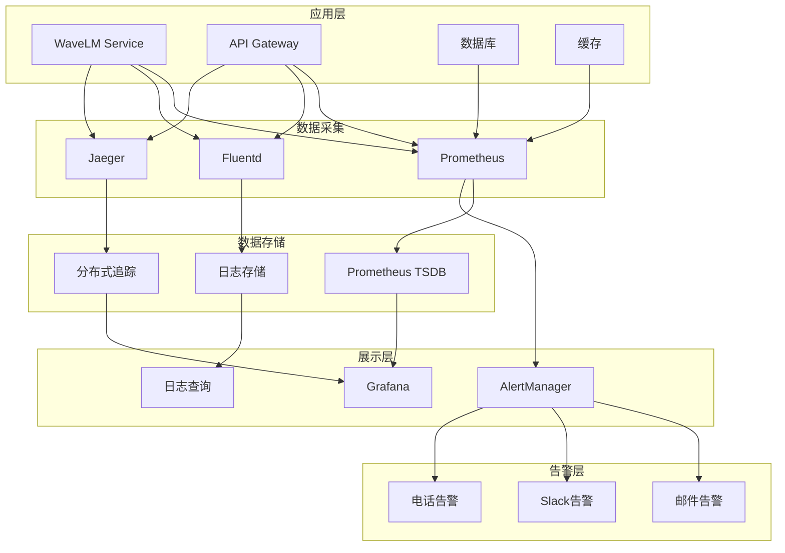

# 监控和运维配置

## 📋 概述

本文档提供了 WavLM 声纹识别服务的完整监控和运维配置，包括 Prometheus、Grafana、日志收集、告警管理等核心功能。

---

## 📊 监控架构

### 1. 整体架构



### 2. 监控组件清单

| 组件 | 用途 | 规格 |
|------|------|------|
| **Prometheus** | 指标收集和存储 | 2 核 4GB |
| **Grafana** | 监控面板展示 | 2 核 4GB |
| **AlertManager** | 告警管理 | 1 核 2GB |
| **Fluentd** | 日志收集 | 1 核 2GB |
| **Jaeger** | 分布式追踪 | 2 核 4GB |
| **ELK Stack** | 日志分析 | 4 核 8GB |

---

## 🔧 Prometheus 配置

### 1. Prometheus 主配置

```yaml
# prometheus-config.yaml
global:
  scrape_interval: 15s
  evaluation_interval: 15s
  external_labels:
    cluster: 'speech-recognition'
    environment: 'production'

rule_files:
  - "rules/*.yml"

scrape_configs:
  # Kubernetes 节点监控
  - job_name: 'kubernetes-nodes'
    kubernetes_sd_configs:
      - role: node
    relabel_configs:
      - source_labels: [__address__]
        target_label: __address__
        regex: '(.+):10250'
        replacement: '${1}:9100'

  # Pod 监控
  - job_name: 'kubernetes-pods'
    kubernetes_sd_configs:
      - role: pod
    relabel_configs:
      - source_labels: [__meta_kubernetes_pod_annotation_prometheus_io_scrape]
        action: keep
        regex: true
      - source_labels: [__meta_kubernetes_pod_annotation_prometheus_io_path]
        action: replace
        target_label: __metrics_path__
        regex: (.+)
      - source_labels: [__address__, __meta_kubernetes_pod_annotation_prometheus_io_port]
        action: replace
        regex: ([^:]+)(?::\d+)?;(\d+)
        replacement: $1:$2
        target_label: __address__
      - action: labelmap
        regex: __meta_kubernetes_pod_label_(.+)
      - source_labels: [__meta_kubernetes_namespace]
        action: replace
        target_label: namespace
      - source_labels: [__meta_kubernetes_pod_name]
        action: replace
        target_label: pod

  # WaveLM 服务监控
  - job_name: 'wavlm-service'
    static_configs:
      - targets: ['wavlm-service:8001']
      labels:
        service: 'wavlm-service'
        environment: 'production'
    scrape_interval: 5s
    metrics_path: /metrics

  # Redis 监控
  - job_name: 'redis'
    static_configs:
      - targets: ['redis-service:9121']
      labels:
        service: 'redis'
        environment: 'production'

  # PostgreSQL 监控
  - job_name: 'postgres'
    static_configs:
      - targets: ['postgres-exporter:9187']
      labels:
        service: 'postgres'
        environment: 'production'

  # Nginx 监控
  - job_name: 'nginx'
    static_configs:
      - targets: ['nginx-exporter:9113']
      labels:
        service: 'nginx'
        environment: 'production'

  # GPU 监控
  - job_name: 'gpu-monitoring'
    static_configs:
      - targets: ['node-exporter:9100']
    relabel_configs:
      - source_labels: [__metrics_path__]
        regex: /metrics
        target_label: __metrics_path__
        replacement: /metrics/gpu
```

### 2. 告警规则配置

```yaml
# alerts.yml
groups:
  - name: wavlm-service-alerts
    rules:
      # 高错误率告警
      - alert: HighErrorRate
        expr: rate(http_requests_total{status=~"5.."}[5m]) > 0.1
        for: 5m
        labels:
          severity: critical
          team: speech-recognition
        annotations:
          summary: "服务错误率过高"
          description: "{{ $labels.service }} 错误率在过去 5 分钟内超过 10%，当前值: {{ $value }}"

      # 响应时间告警
      - alert: HighResponseTime
        expr: histogram_quantile(0.95, rate(http_request_duration_seconds_bucket[5m])) > 1
        for: 3m
        labels:
          severity: warning
          team: speech-recognition
        annotations:
          summary: "服务响应时间过长"
          description: "{{ $labels.service }} P95 响应时间在过去 3 分钟内超过 1 秒，当前值: {{ $value }}"

      # 内存使用率告警
      - alert: HighMemoryUsage
        expr: (container_memory_usage_bytes{container="wavlm-service"} / container_spec_memory_limit_bytes{container="wavlm-service"}) > 0.8
        for: 5m
        labels:
          severity: warning
          team: speech-recognition
        annotations:
          summary: "内存使用率过高"
          description: "{{ $labels.service }} 内存使用率超过 80%，当前值: {{ $value | humanizePercentage }}"

      # CPU 使用率告警
      - alert: HighCPUUsage
        expr: rate(container_cpu_usage_seconds_total{container="wavlm-service"}[5m]) > 0.8
        for: 5m
        labels:
          severity: warning
          team: speech-recognition
        annotations:
          summary: "CPU 使用率过高"
          description: "{{ $labels.service }} CPU 使用率超过 80%，当前值: {{ $value | humanizePercentage }}"

      # 服务不可用告警
      - alert: ServiceUnavailable
        expr: up{job="wavlm-service"} == 0
        for: 1m
        labels:
          severity: critical
          team: speech-recognition
        annotations:
          summary: "服务不可用"
          description: "{{ $labels.service }} 服务在过去 1 分钟内不可用"

      # GPU 使用率告警
      - alert: HighGPUUsage
        expr: rate(gpu_utilization[5m]) > 0.9
        for: 3m
        labels:
          severity: warning
          team: speech-recognition
        annotations:
          summary: "GPU 使用率过高"
          description: "{{ $labels.device }} GPU 使用率超过 90%，当前值: {{ $value | humanizePercentage }}"

      # 数据库连接告警
      - alert: DatabaseConnectionsExhausted
        expr: pg_stat_database_numbackends > 90
        for: 5m
        labels:
          severity: critical
          team: speech-recognition
        annotations:
          summary: "数据库连接池耗尽"
          description: "数据库连接数超过 90，当前值: {{ $value }}"

      # Redis 内存告警
      - alert: RedisMemoryHigh
        expr: redis_memory_used_bytes / redis_memory_max_bytes > 0.8
        for: 5m
        labels:
          severity: warning
          team: speech-recognition
        annotations:
          summary: "Redis 内存使用率过高"
          description: "Redis 内存使用率超过 80%，当前值: {{ $value | humanizePercentage }}"

  - name: infrastructure-alerts
    rules:
      # 节点不可用告警
      - alert: NodeDown
        expr: up{job="kubernetes-nodes"} == 0
        for: 1m
        labels:
          severity: critical
          team: infrastructure
        annotations:
          summary: "节点不可用"
          description: "Kubernetes 节点 {{ $labels.instance }} 不可用"

      # 磁盘空间告警
      - alert: DiskSpaceLow
        expr: (node_filesystem_size_bytes{fstype!="tmpfs"} - node_filesystem_free_bytes{fstype!="tmpfs"}) / node_filesystem_size_bytes{fstype!="tmpfs"} > 0.85
        for: 5m
        labels:
          severity: warning
          team: infrastructure
        annotations:
          summary: "磁盘空间不足"
          description: "{{ $labels.instance }} 磁盘使用率超过 85%，当前值: {{ $value | humanizePercentage }}"

      # 网络流量告警
      - alert: HighNetworkTraffic
        expr: rate(node_network_receive_bytes_total[5m]) / 1024 / 1024 > 100
        for: 5m
        labels:
          severity: warning
          team: infrastructure
        annotations:
          summary: "网络流量过高"
          description: "{{ $labels.instance }} 网络接收速率超过 100MB/s，当前值: {{ $value }}MB/s"
```

### 3. AlertManager 配置

```yaml
# alertmanager-config.yaml
global:
  smtp_smarthost: 'localhost:587'
  smtp_from: 'alerts@vidda.com'
  smtp_auth_username: 'alerts@vidda.com'
  smtp_auth_password: 'password'

route:
  group_by: ['alertname']
  group_wait: 10s
  group_interval: 10s
  repeat_interval: 12h
  receiver: 'web.hook'

  routes:
  - match:
      severity: critical
    receiver: 'critical-alerts'
    repeat_interval: 1h

  - match:
      severity: warning
    receiver: 'warning-alerts'
    repeat_interval: 6h

receivers:
- name: 'web.hook'
  webhook_configs:
  - url: 'http://localhost:5001/'

- name: 'critical-alerts'
  email_configs:
  - to: 'emergency@vidda.com'
    subject: '[CRITICAL] {{ .GroupLabels.alertname }}'
    body: |
      {{ range .Alerts }}
      Alert: {{ .Annotations.summary }}
      Description: {{ .Annotations.description }}
      Severity: {{ .Labels.severity }}
      Time: {{ .StartsAt }}
      {{ end }}
  slack_configs:
  - api_url: 'https://hooks.slack.com/services/YOUR/SLACK/WEBHOOK'
    channel: '#alerts-critical'
    title: '🚨 Critical Alert'
    color: 'danger'

- name: 'warning-alerts'
  email_configs:
  - to: 'dev@vidda.com'
    subject: '[WARNING] {{ .GroupLabels.alertname }}'
    body: |
      {{ range .Alerts }}
      Alert: {{ .Annotations.summary }}
      Description: {{ .Annotations.description }}
      Severity: {{ .Labels.severity }}
      Time: {{ .StartsAt }}
      {{ end }}
  slack_configs:
  - api_url: 'https://hooks.slack.com/services/YOUR/SLACK/WEBHOOK'
    channel: '#alerts-warning'
    title: '⚠️ Warning Alert'
    color: 'warning'

inhibit_rules:
  - source_match:
      severity: 'critical'
    target_match:
      severity: 'warning'
    equal: ['alertname', 'dev', 'instance']
```

---

## 📊 Grafana 配置

### 1. 数据源配置

```json
{
  "datasources": [
    {
      "name": "Prometheus",
      "type": "prometheus",
      "access": "proxy",
      "url": "http://prometheus:9090",
      "isDefault": true,
      "editable": false,
      "jsonData": {
        "timeInterval": "15s",
        "httpMethod": "POST",
        "queryTimeout": "60s",
        "timeField": "@timestamp"
      }
    },
    {
      "name": "Loki",
      "type": "loki",
      "access": "proxy",
      "url": "http://loki:3100",
      "isDefault": false,
      "editable": false,
      "jsonData": {
        "maxLines": 1000
      }
    }
  ]
}
```

### 2. 仪表板配置

#### 2.1 服务性能仪表板

```json
{
  "dashboard": {
    "title": "WavLM 服务性能监控",
    "panels": [
      {
        "title": "QPS 和错误率",
        "type": "graph",
        "gridPos": {"h": 8, "w": 12, "x": 0, "y": 0},
        "targets": [
          {
            "expr": "sum(rate(http_requests_total[5m])) by (service)",
            "legendFormat": "QPS"
          },
          {
            "expr": "sum(rate(http_requests_total{status=~\"5..\"}[5m])) by (service)",
            "legendFormat": "错误数"
          }
        ],
        "yAxes": [
          {
            "label": "QPS",
            "position": "left"
          },
          {
            "label": "错误数",
            "position": "right"
          }
        ]
      },
      {
        "title": "响应时间分布",
        "type": "graph",
        "gridPos": {"h": 8, "w": 12, "x": 12, "y": 0},
        "targets": [
          {
            "expr": "histogram_quantile(0.95, rate(http_request_duration_seconds_bucket[5m]))",
            "legendFormat": "P95 响应时间"
          },
          {
            "expr": "histogram_quantile(0.50, rate(http_request_duration_seconds_bucket[5m]))",
            "legendFormat": "P50 响应时间"
          }
        ],
        "yAxes": [
          {
            "label": "响应时间 (秒)",
            "position": "left"
          }
        ]
      },
      {
        "title": "状态码分布",
        "type": "stat",
        "gridPos": {"h": 6, "w": 6, "x": 0, "y": 8},
        "targets": [
          {
            "expr": "sum by (status) (rate(http_requests_total[5m]))",
            "legendFormat": "状态码 {{status}}: {{value}}"
          }
        ]
      },
      {
        "title": "CPU 使用率",
        "type": "graph",
        "gridPos": {"h": 6, "w": 6, "x": 6, "y": 8},
        "targets": [
          {
            "expr": "rate(container_cpu_usage_seconds_total{container=\"wavlm-service\"}[5m])",
            "legendFormat": "CPU 使用率"
          }
        ],
        "yAxes": [
          {
            "label": "CPU 使用率",
            "position": "left"
          }
        ]
      },
      {
        "title": "内存使用率",
        "type": "graph",
        "gridPos": {"h": 6, "w": 6, "x": 12, "y": 8},
        "targets": [
          {
            "expr": "container_memory_usage_bytes{container=\"wavlm-service\"}",
            "legendFormat": "内存使用"
          }
        ],
        "yAxes": [
          {
            "label": "内存使用 (字节)",
            "position": "left"
          }
        ]
      },
      {
        "title": "GPU 使用率",
        "type": "graph",
        "gridPos": {"h": 6, "w": 6, "x": 18, "y": 8},
        "targets": [
          {
            "expr": "rate(gpu_utilization[5m])",
            "legendFormat": "GPU 使用率"
          }
        ],
        "yAxes": [
          {
            "label": "GPU 使用率",
            "position": "left"
          }
        ]
      }
    ]
  }
}
```

#### 2.2 业务仪表板

```json
{
  "dashboard": {
    "title": "WavLM 业务监控",
    "panels": [
      {
        "title": "活跃用户数",
        "type": "singlestat",
        "gridPos": {"h": 4, "w": 8, "x": 0, "y": 0},
       targets": [
          {
            "expr": "active_users",
            "legendFormat": "活跃用户"
          }
        ]
      },
      {
        "title": "用户满意度",
        "type": "gauge",
        "gridPos": {"h": 4, "w": 8, "x": 8, "y": 0},
        "targets": [
          {
            "expr": "user_satisfaction",
            "legendFormat": "满意度"
          }
        ],
        "rangeMaps": [
          {
            "from": "0",
            "to": "60",
            "text": "差",
            "color": "red"
          },
          {
            "from": "60",
            "to": "80",
            "text": "中",
            "color": "yellow"
          },
          {
            "from": "80",
            "to": "100",
            "text": "好",
            "color": "green"
          }
        ]
      },
      {
        "title": "识别准确率",
        "type": "timeseries",
        "gridPos": {"h": 8, "w": 12, "x": 0, "y": 4},
        "targets": [
          {
            "expr": "recognition_accuracy",
            "legendFormat": "准确率"
          }
        ]
      },
      {
        "title": "EER (等错误率)",
        "type": "timeseries",
        "gridPos": {"h": 8, "w": 12, "x": 12, "y": 4},
        "targets": [
          {
            "expr": "eer_value",
            "legendFormat": "EER"
          }
        ],
        "yAxes": [
          {
            "label": "EER",
            "position": "left"
          }
        ]
      }
    ]
  }
}
```

---

## 📝 日志管理

### 1. 日志架构

```yaml
# logging-config.yaml
version: 1

disable_existing_loggers: false

formatters:
  standard:
    format: '%(asctime)s [%(levelname)s] %(name)s: %(message)s'
    datefmt: '%Y-%m-%d %H:%M:%S'

  json:
    class: pythonjsonlogger.jsonlogger.JsonFormatter
    format: '%(asctime)s %(name)s %(levelname)s %(message)s'

handlers:
  console:
    class: logging.StreamHandler
    formatter: standard
    stream: ext://sys.stdout

  file:
    class: logging.handlers.RotatingFileHandler
    formatter: standard
    filename: /var/log/wavlm/wavlm.log
    maxBytes: 10485760
    backupCount: 5

  json_file:
    class: logging.handlers.RotatingFileHandler
    formatter: json
    filename: /var/log/wavlm/wavlm.json.log
    maxBytes: 10485760
    backupCount: 5

  fluentd:
    class: fluent.handler.FluentHandler
    formatter: json
    host: fluentd
    port: 24224
    tag: wavlm.service

loggers:
  '':
    handlers: [console, file, json_file, fluentd]
    level: INFO
    propagate: false

  uvicorn:
    handlers: [console, file]
    level: INFO
    propagate: false

  sqlalchemy:
    handlers: [console, file]
    level: WARNING
    propagate: false
```

### 2. Fluentd 配置

```xml
# fluentd-config.conf
<source>
  @type tail
  path /var/log/wavlm/*.log
  pos_file /var/log/fluentd/wavlm.log.pos
  tag wavlm.service
  format json
  time_format %Y-%m-%dT%H:%M:%S.%L%z
  read_from_head true
</source>

<source>
  @type prometheus
  <metric>
    name wavlm_service_logs_total
    type counter
    desc Total number of processed logs
  </metric>
</source>

<filter wavlm.service>
  @type record_transformer
  <record>
    hostname ${hostname}
  </record>
</filter>

<match wavlm.service>
  @type elasticsearch
  host elasticsearch
  port 9200
  index_name wavlm-service-logs
  type_name _doc
  include_tag_key true
  tag_key @log_name
  <buffer>
    flush_mode interval
    flush_interval 30s
    chunk_limit_size 8MB
    retry_max_interval 30s
  </buffer>
</match>

<match **>
  @type stdout
</match>
```

### 3. Logstash 配置

```ruby
# logstash-config.conf
input {
  beats {
    port => 5044
  }
}

filter {
  if [fields][service] == "wavlm" {
    grok {
      match => { "message" => "%{TIMESTAMP_ISO8601:timestamp} \[%{LOGLEVEL:level}\] %{WORD:logger}: %{GREEDYDATA:message}" }
    }

    if "_grokparsefailure" in [tags] {
      drop {}
    }

    date {
      match => [ "timestamp", "ISO8601" ]
    }

    mutate {
      add_field => { "service" => "wavlm" }
      add_field => { "environment" => "production" }
      remove_field => [ "timestamp" ]
    }

    if [level] == "ERROR" {
      mutate {
        add_tag => [ "error" ]
      }
    }

    if [level] == "WARNING" {
      mutate {
        add_tag => [ "warning" ]
      }
    }

    useragent {
      source => "user_agent"
      target => "user_agent"
    }

    geoip {
      source => "client_ip"
      target => "geoip"
    }
  }
}

output {
  if [fields][service] == "wavlm" {
    elasticsearch {
      hosts => ["elasticsearch:9200"]
      index => "wavlm-logs-%{+YYYY.MM.dd}"
      document_type => "_doc"
    }

    stdout {
      codec => rubydebug
    }
  }
}
```

---

## 🔧 运维自动化

### 1. CI/CD 配置

```yaml
# .gitlab-ci.yml
stages:
  - build
  - test
  - deploy
  - monitor

variables:
  DOCKER_DRIVER: overlay2
  DOCKER_TLS_CERTDIR: "/certs"
  KUBE_NAMESPACE: "speech-recognition"
  KUBE_CONFIG: "kube-config-prod"

# 构建镜像
build:
  stage: build
  image: docker:latest
  services:
    - docker:dind
  variables:
    DOCKER_HOST: tcp://docker:2375
  script:
    - docker build -t registry.vidda.com/wavlm-service:$CI_COMMIT_SHA .
    - docker push registry.vidda.com/wavlm-service:$CI_COMMIT_SHA

# 测试
test:
  stage: test
  image: python:3.9
  before_script:
    - pip install -r requirements.txt
    - pip install pytest pytest-cov
  script:
    - pytest tests/ --cov=wavlm_service --cov-report=xml --cov-report=html
  artifacts:
    reports:
      coverage_report:
        coverage_format: cobertura
        path: coverage.xml
    paths:
      - htmlcov/
    expire_in: 1 week

# 安全扫描
security-scan:
  stage: test
  image: python:3.9
  script:
    - pip install bandit safety
    - bandit -r wavlm_service/ -f json -o bandit-report.json
    - safety check --json --output safety-report.json
  artifacts:
    paths:
      - bandit-report.json
      - safety-report.json
    expire_in: 1 week

# 部署到测试环境
deploy-staging:
  stage: deploy
  image: kubectl:latest
  script:
    - kubectl config use-context $KUBE_CONFIG
    - sed -i "s|image: .*|image: registry.vidda.com/wavlm-service:$CI_COMMIT_SHA|" k8s/staging-deployment.yaml
    - kubectl apply -f k8s/staging-deployment.yaml
    - kubectl rollout status deployment/wavlm-service-staging -n $KUBE_NAMESPACE --timeout=300s
  only:
    - develop

# 部署到生产环境
deploy-production:
  stage: deploy
  image: kubectl:latest
  script:
    - kubectl config use-context $KUBE_CONFIG
    - sed -i "s|image: .*|image: registry.vidda.com/wavlm-service:$CI_COMMIT_SHA|" k8s/production-deployment.yaml
    - kubectl apply -f k8s/production-deployment.yaml
    - kubectl rollout status deployment/wavlm-service -n $KUBE_NAMESPACE --timeout=300s
  only:
    - main
  when: manual

# 监控部署后状态
monitor-deployment:
  stage: monitor
  image: curlimages/curl
  script:
    - echo "等待服务启动..."
    - sleep 30
    - curl -f http://wavlm-service:8000/health || exit 1
    - curl -f http://wavlm-service:8000/ready || exit 1
    - echo "服务健康检查通过"
  dependencies:
    - deploy-production
```

### 2. 自动化运维脚本

```bash
#!/bin/bash
# auto-ops.sh

set -e

NAMESPACE="speech-recognition"
PROMETHEUS_URL="http://prometheus:9090"
GRAFANA_URL="http://grafana:3000"

# 获取服务状态
get_service_status() {
    echo "=== 服务状态检查 ==="
    kubectl get pods -n $NAMESPACE -l app=wavlm-service
    kubectl get svc -n $NAMESPACE -l app=wavlm-service
    kubectl get hpa -n $NAMESPACE -l app=wavlm-service
}

# 获取健康检查
health_check() {
    echo "=== 健康检查 ==="
    # 检查 Prometheus
    if curl -f $PROMETHEUS_URL/-/healthy > /dev/null 2>&1; then
        echo "✅ Prometheus 运行正常"
    else
        echo "❌ Prometheus 运行异常"
    fi

    # 检查 Grafana
    if curl -f $GRAFANA_URL/api/health > /dev/null 2>&1; then
        echo "✅ Grafana 运行正常"
    else
        echo "❌ Grafana 运行异常"
    fi

    # 检查 WaveLM 服务
    if kubectl get pods -n $NAMESPACE -l app=wavlm-service | grep -q "Running"; then
        echo "✅ WaveLM 服务运行正常"
    else
        echo "❌ WaveLM 服务运行异常"
    fi
}

# 获取性能指标
get_metrics() {
    echo "=== 性能指标 ==="
    # 获取 QPS
    QPS=$(curl -s "$PROMETHEUS_URL/api/v1/query?query=rate(http_requests_total[5m])" | jq '.data.result[0].value[1]' | tr -d '"')
    echo "当前 QPS: $QPS"

    # 获取错误率
    ERROR_RATE=$(curl -s "$PROMETHEUS_URL/api/v1/query?query=rate(http_requests_total{status=~\"5..\"}[5m])/rate(http_requests_total[5m])*100" | jq '.data.result[0].value[1]' | tr -d '"')
    echo "当前错误率: $ERROR_RATE%"

    # 获取响应时间
    RESPONSE_TIME=$(curl -s "$PROMETHEUS_URL/api/v1/query?query=histogram_quantile(0.95, rate(http_request_duration_seconds_bucket[5m]))" | jq '.data.result[0].value[1]' | tr -d '"')
    echo "P95 响应时间: ${RESPONSE_TIME}s"
}

# 资源清理
cleanup() {
    echo "=== 资源清理 ==="
    # 清理日志文件
    find /var/log/wavlm -name "*.log" -mtime +7 -delete
    echo "已清理 7 天前的日志文件"

    # 清理临时文件
    find /tmp -name "wavlm_*" -mtime +1 -delete
    echo "已清理 1 天前的临时文件"

    # 清理镜像
    kubectl get pods -n $NAMESPACE -o jsonpath='{range .items[*]}{.status.containerStatuses[0].image}{"\n"}' | sort | uniq -c | sort -nr
}

# 备份配置
backup_config() {
    echo "=== 备份配置 ==="
    BACKUP_DIR="/backup/wavlm/$(date +%Y%m%d_%H%M%S)"
    mkdir -p $BACKUP_DIR

    # 备份 Kubernetes 配置
    kubectl get configmap -n $NAMESPACE -o yaml > $BACKUP_DIR/configmaps.yaml
    kubectl get secret -n $NAMESPACE -o yaml > $BACKUP_DIR/secrets.yaml
    kubectl get deployment -n $NAMESPACE -o yaml > $BACKUP_DIR/deployments.yaml

    # 备份 Prometheus 配置
    curl -s $PROMETHEUS_URL/api/v1/status/tsdb | jq .data > $BACKUP_DIR/prometheus-status.json

    # 压缩备份
    tar -czf $BACKUP_DIR.tar.gz -C $(dirname $BACKUP_DIR) $(basename $BACKUP_DIR)
    rm -rf $BACKUP_DIR

    echo "配置已备份到: $BACKUP_DIR.tar.gz"
}

# 主菜单
case "$1" in
    "status")
        get_service_status
        ;;
    "health")
        health_check
        ;;
    "metrics")
        get_metrics
        ;;
    "cleanup")
        cleanup
        ;;
    "backup")
        backup_config
        ;;
    *)
        echo "使用方法: $0 {status|health|metrics|cleanup|backup}"
        exit 1
        ;;
esac
```

---

## 🔒 安全配置

### 1. RBAC 配置

```yaml
# rbac.yaml
apiVersion: v1
kind: ServiceAccount
metadata:
  name: wavlm-service-account
  namespace: speech-recognition

---
apiVersion: rbac.authorization.k8s.io/v1
kind: Role
metadata:
  name: wavlm-service-role
  namespace: speech-recognition
rules:
- apiGroups: [""]
  resources: ["pods", "services", "configmaps", "secrets"]
  verbs: ["get", "list", "watch"]
- apiGroups: ["apps"]
  resources: ["deployments", "replicasets"]
  verbs: ["get", "list", "watch"]
- apiGroups: ["networking.k8s.io"]
  resources: ["ingresses"]
  verbs: ["get", "list", "watch"]

---
apiVersion: rbac.authorization.k8s.io/v1
kind: RoleBinding
metadata:
  name: wavlm-service-binding
  namespace: speech-recognition
roleRef:
  apiGroup: rbac.authorization.k8s.io
  kind: Role
  name: wavlm-service-role
subjects:
- kind: ServiceAccount
  name: wavlm-service-account
  namespace: speech-recognition

---
apiVersion: rbac.authorization.k8s.io/v1
kind: ClusterRole
metadata:
  name: prometheus
rules:
- apiGroups: [""]
  resources: ["nodes", "services", "endpoints", "pods", "configmaps"]
  verbs: ["get", "list", "watch"]
- apiGroups: ["extensions"]
  resources: ["ingresses"]
  verbs: ["get", "list", "watch"]

---
apiVersion: rbac.authorization.k8s.io/v1
kind: ClusterRoleBinding
metadata:
  name: prometheus
roleRef:
  apiGroup: rbac.authorization.k8s.io
  kind: ClusterRole
  name: prometheus
subjects:
- kind: ServiceAccount
  name: default
  namespace: monitoring
```

### 2. 网络策略

```yaml
# network-policy.yaml
apiVersion: networking.k8s.io/v1
kind: NetworkPolicy
metadata:
  name: wavlm-network-policy
  namespace: speech-recognition
spec:
  podSelector:
    matchLabels:
      app: wavlm-service
  policyTypes:
  - Ingress
  - Egress
  ingress:
  - from:
    - namespaceSelector:
        matchLabels:
          name: monitoring
    - namespaceSelector:
        matchLabels:
          name: kube-system
    - podSelector:
        matchLabels:
          app: load-balancer
    ports:
    - protocol: TCP
      port: 8000
    - protocol: TCP
      port: 8001
  egress:
  - to:
    - namespaceSelector:
        matchLabels:
          name: speech-recognition
    - namespaceSelector:
        matchLabels:
          name: monitoring
    ports:
    - protocol: TCP
      port: 5432
    - protocol: TCP
      port: 6379
    - protocol: TCP
      port: 9090
  - to:
    - ipBlock:
        cidr: 0.0.0.0/0
        except:
        - 10.0.0.0/8
        - 172.16.0.0/12
        - 192.168.0.0/16
    ports:
    - protocol: TCP
      port: 443
```

---

## 📞 故障处理

### 1. 常见问题处理

#### 1.1 服务无法启动
```bash
# 查看 Pod 状态
kubectl describe pod <pod-name> -n speech-recognition

# 查看 Pod 日志
kubectl logs <pod-name> -n speech-recognition --tail=100

# 查看 Pod 事件
kubectl get events -n speech-recognition --sort-by='.metadata.creationTimestamp'
```

#### 1.2 内存泄漏
```bash
# 检查内存使用
kubectl top pods -n speech-recognition

# 分析内存占用
kubectl exec <pod-name> -n speech-recognition -- /bin/sh -c 'ps aux | grep -v grep'

# 导出内存分析
kubectl exec <pod-name> -n speech-recognition -- /bin/sh -c 'cat /proc/*/status | grep VmRSS'
```

#### 1.3 网络问题
```bash
# 检查网络连接
kubectl exec <pod-name> -n speech-recognition -- /bin/sh -c 'curl -I http://localhost:8000/health'

# 检查端口映射
kubectl get svc -n speech-recognition

# 检查 DNS 解析
kubectl exec <pod-name> -n speech-recognition -- /bin/sh -c 'nslookup google.com'
```

### 2. 应急响应流程

```bash
#!/bin/bash
# emergency-response.sh

NAMESPACE="speech-recognition"

echo "=== 应急响应流程 ==="

# 1. 确认问题
read -p "请确认问题类型: [1]服务不可用 [2]性能问题 [3]安全问题: " PROBLEM_TYPE

case $PROBLEM_TYPE in
    1)
        echo "=== 服务不可用处理 ==="
        # 检查服务状态
        kubectl get pods -n $NAMESPACE -l app=wavlm-service
        # 重启服务
        kubectl rollout restart deployment/wavlm-service -n $NAMESPACE
        # 扩容
        kubectl scale deployment wavlm-service --replicas=10 -n $NAMESPACE
        ;;
    2)
        echo "=== 性能问题处理 ==="
        # 检查资源使用
        kubectl top pods -n $NAMESPACE
        # 扩容
        kubectl scale deployment wavlm-service --replicas=10 -n $NAMESPACE
        # 清理缓存
        kubectl exec -it <pod-name> -n $NAMESPACE -- /bin/sh -c 'redis-cli FLUSHDB'
        ;;
    3)
        echo "=== 安全问题处理 ==="
        # 停止服务
        kubectl scale deployment wavlm-service --replicas=0 -n $NAMESPACE
        # 检查日志
        kubectl logs -l app=wavlm-service -n $NAMESPACE --tail=1000
        # 通知安全团队
        echo "安全事件已通知安全团队"
        ;;
    *)
        echo "未知问题类型"
        exit 1
        ;;
esac

# 3. 监控恢复
echo "=== 监控恢复状态 ==="
sleep 30
kubectl get pods -n $NAMESPACE -l app=wavlm-service

echo "=== 应急响应完成 ==="
```

---

## 📋 维护清单

### 1. 日常维护

- [ ] 检查监控系统状态
- [ ] 检查日志文件大小
- [ ] 验证告警规则
- [ ] 检查备份状态
- [ ] 清理临时文件

### 2. 周度维护

- [ ] 更告警规则
- [ ] 优化监控面板
- [ ] 清理过期日志
- [ ] 备份配置文件
- [ ] 更新安全策略

### 3. 月度维护

- [ ] 安全扫描
- [ ] 性能测试
- [ ] 容量评估
- [ ] 成本分析
- [ ] 文档更新

---

**注意**: 本配置文件需要根据实际的运维环境和业务需求进行调整。建议在生产环境使用前进行全面测试。